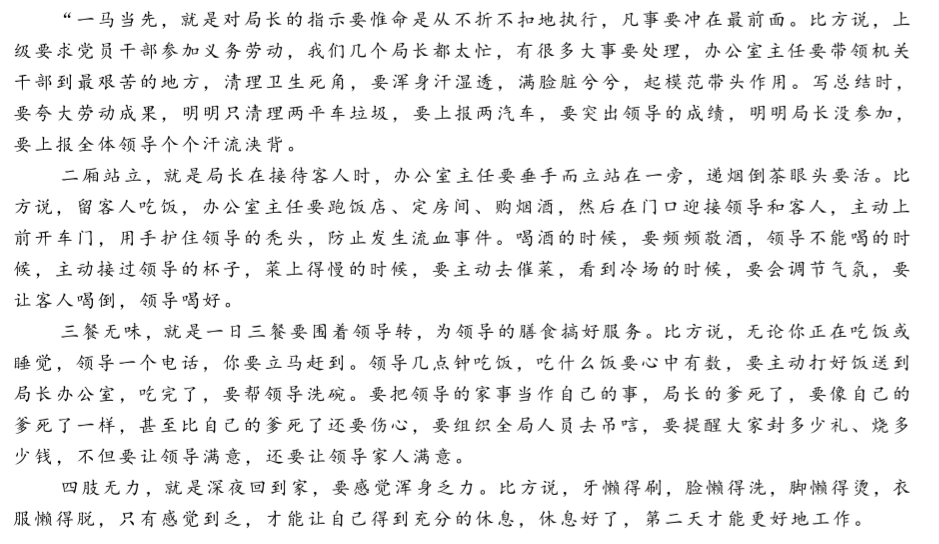
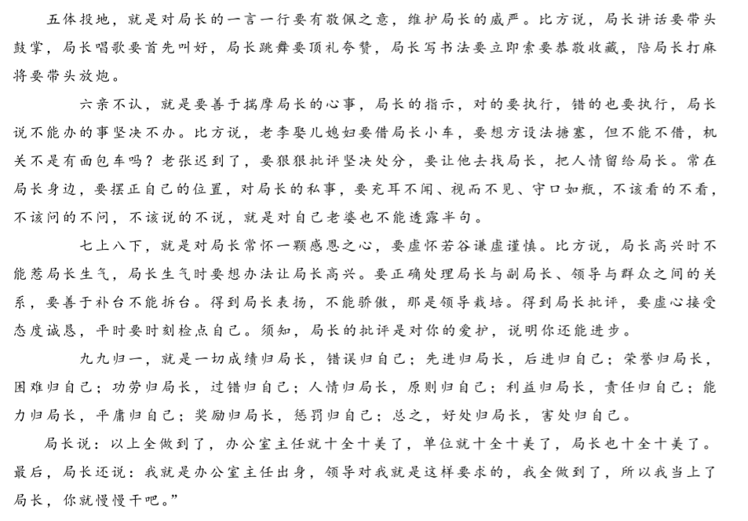
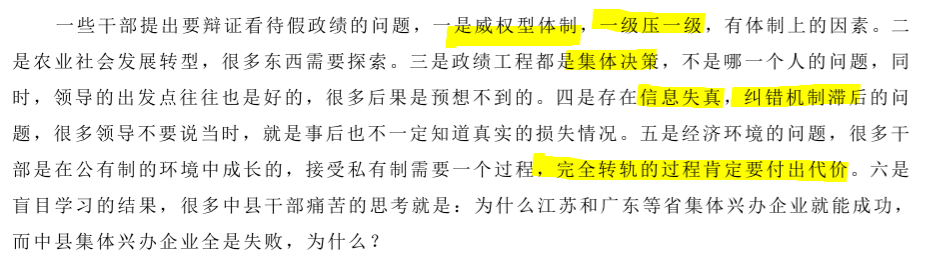

**政——党螺旋晋升模式**
县委县政府和人大政协形成的超稳定结构： 对于县委县政府一线岗位来说，先在政府实践历练，然后晋升入党委系统决策，从而保证了工作的延续性和决策的全面性。而且这些一线岗位领导干部的年龄结构基本是在35-50岁之间，正是年富力强，又有经验又有实践的人生高峰期，等于是把政治精英的人生精华时期放在了党政系统。在一线岗位竞争式的锦标赛中，优胜者得以继续晋升，淘汰者则可以进入人大政协二线岗位，继续发挥监督或者参政的作用，这样就形成==既有出口，又有后路==的**超稳定结构**。这对于政治体系的良性运转，平衡各种力量结构，缓冲体制内的矛盾和争斗，起到很大的作用，因此是改革开放30年取得巨大成就的体制基础和组织基础之一。

两办多出干部（县委办、政府办）

办公室主任：

