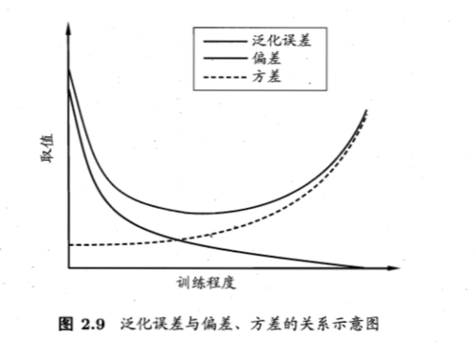

# 机器学习

## 第一章 绪论

**版本空间**：有多个假设与训练集一致，即存在着一个与训练集一致的”训练集合“

**归纳偏好**：在学习过程中对某种类型假设的偏好--”奥卡姆剃刀原则“

为简单起见，假设样本空间$\mathcal{X}$和假设空间$\mathcal{H}$都是离散的，令$P(h|X,\xi_a)$代表算法$\xi_a$基于训练数据X产生假设h的概率，再令f代表我们希望学习的真实目标函数。$\xi_a$的“训练集外误差”，即$\xi_a$在训练集之外的所有样本上的误差为
$$
E_{ote}(\xi_a|X,f)=\sum_h\sum_{x\in \mathcal{X}-{X}}P(\textbf{x})\mathbb{I}(h(\textbf{x})\neq f(\textbf{x}))P(h|X,\xi_a)
$$
其中$\mathbb{I}(\cdot)$是指示函数，若$\cdot$为真则取值1，否则取值0

**NFL定理**：不同的学习算法的期望误差相等（前提：所有问题出现的机会相同\所有问题同等重要）

寓意：脱离具体问题，空泛地谈论“什么学习算法更好”毫无意义

## 第2章 模型评估与选择

### 2.1 经验误差与过拟合

**错误率**：分类错误的样本数占样本总数的比例

**误差：**学习器的实际预测输出与样本的真实输出之间的差异

- **训练误差/经验误差**：学习器在训练集上的误差
- **泛化误差**：学习器在新样本上的误差

### 2.2 评估方法

测试集与训练集划分方法：

- 留出法：将数据集划分为两个互斥的集合（2/3-4/5样本用于训练）
- 交叉验证法：将数据集划分为k个大小相似的互斥子集，每个子集都尽可能保持数据分布的一致性（分层采样），每次用k-1个子集的并集作为训练集，余下的那个子集作为测试集。最终返回的是这k个测试结果的均值   “k折交叉验证”
- 自助法：以自助采样法为基础，给定包含m个样本的数据集D，对它进行采样产生数据集$D'$：每次随机从D中挑选出一个样本，将其拷贝放入$D'$，然后再将该样本放回初始数据集D中，使得该样本在下次采用时仍有可能被采到：这个过程重复执行m次后，D中有一部分样本会在$D'$中多次出现，另一部分样本不出现，样本在m次采用中始终不被采到的概率是$(1-\frac{1}{m})^m$，取极限得到趋近于$\frac{1}{e}\approx0.368$，$D'$用作训练集，$D\backslash D'$用作测试集，”包外估计“

### 2.3 性能度量

**均方误差**：
$$
E(f;D)=\frac{1}{m}\sum_{i=1}^m(f(x_i)-y_i)^2
$$
对于数据分布$\mathcal{D}$和概率密度函数$p(\cdot)$，均方误差可描述为：
$$
E(f;\mathcal{D})=\int_{x\sim\mathcal{D}}(f(\textbf{x})-y)^2p(\textbf{x})d\textbf{x}
$$
错误率定义：
$$
E(f;D)=\frac{1}{m}\sum_{i=1}^m\mathbb{I}(f(x_i)\neq y_i)
$$
精度定义：
$$
acc(f;D)=1-E(f,D)
$$

P-R图：查准率为纵轴、查全率为横轴

性能度量：

- **平衡点**（BEP）：“查准率=查全率”时的取值

- **F1度量**：
  $$
  F1=\frac{2\times P\times R}{P+R}=\frac{2\times TP}{样例总数+TP-TN}
  $$

- **$F_\beta$度量**：
  $$
  F_\beta=\frac{(1+\beta^2)\times P\times R}{(\beta^2\times P)+R}
  $$
  其中$\beta>0$度量了查全率对查准率的相对重要性，$\beta>1$时查全率有更大影响；$\beta<1$时查准率有更大影响。
  $$
  \frac{1}{F_1}=\frac{1}{2}\cdot(\frac{1}{P}+\frac{1}{R})\\\frac{1}{F_\beta}=\frac{1}{1+\beta^2}\cdot(\frac{1}{P}+\frac{\beta^2}{R})
  $$
  得到多个二分类混淆矩阵，”宏查准率(macro-P)“：
  $$
  macro-P=\frac{1}{n}\sum_{i=1}^nP_i\\macro-R=\frac{1}{n}\sum_{i=1}^nR_i\\macro-F1=\frac{2\times macro-P\times macro-R}{macro-P+macro-R}
  $$
  "微查准率(micro-P)":
  $$
  micro-P=\frac{\overline{TP}}{\overline{TP}+\overline{FP}}\\micro-R=\frac{\overline{TP}}{\overline{TP}+\overline{FN}}\\micro-F1=\frac{2\times micro-P\times micro-R}{micro-P+micro-R}
  $$
  **ROC**：全称为”受试者工作特征“，纵轴为”真正例率TPR“，横轴为”假正例率FPR“
  $$
  TPR=\frac{TP}{TP+FN}\\FPR=\frac{FP}{TN+FP}
  $$
  **AUC**:ROC曲线下各部分的面积求和
  $$
  AUC=\frac{1}{2}\sum_{i=1}^{m-1}(x_{i+1}-x_i)\cdot(y_i+y_{i+1})
  $$

**代价敏感错误率**：
$$
E（f;D;cost)=\frac{1}{m}(\sum_{x_i\in D^+}\mathbb{I}(f(x_i)\neq y_i)\times cost_{01}+\sum_{x_i\in D^-}\mathbb{I}(f(x_i)\neq y_i)\times cost_{10})
$$

### 2.4 比较检验

- 二项检验：

  - 泛化错误率小于等于检验错误率
    $$
    \sum_{i=\epsilon_0\times m+1}^{m}\begin{pmatrix}m\\i\end{pmatrix}\epsilon^i(1-\epsilon)^{m-i}<\alpha
    $$

- t检验：

  - k个测试错误率，变量$\tau_t=\frac{\sqrt{k}(\mu-\epsilon_0)}{\sigma}$服从自由度为k-1的t分布

- 交叉验证t检验

- McNemar检验

- Friedman检验与Nemenyi后续检验

### 2.5 偏差与方差

偏差度量了学习算法的期望预测与真实结果的偏离程度，刻画了学习算法本身的拟合能力；方差度量了同样大小的训练集的变动所导致的学习性能的变化，即刻画了数据扰动所造成的影响；噪声表达了在当前任务上任何学习算法所能达到的期望泛化误差的下界，即刻画了学习问题本身的难度，偏差-方差分解说明，泛化性能是由学习算法的能力、数据充分性以及学习任务本身的难度所共同决定的

偏差-方差窘境：

## 第3章 线性模型

### 3.1 基本形式

实例为$\textbf{x}=(x_1;x_2;...;x_d)$,预测函数形式为：$f(\textbf{x})=w_1x_1+w_2x_2+...+w_dx_d+b$,向量形式为：$f(\textbf{x})= w^Tx+b$

### 3.2 线性回归

考虑只有一个属性，线性回归试图学得
$$
f(x_i)=wx_i+b,\quad 使得f(x_i)\simeq y_i
$$

$$
(w^*,b^*)=\mathop{arg\;min}\limits_{(w,b)}\sum_{i=1}^m(f(x_i)-y_i)^2\\=\mathop{arg\;min}\limits_{(w,b)}\sum_{i=1}^m(f(x_i)-y_i)^2
$$

w和b最优解的闭式解：
$$
w=\frac{\sum_{i=1}^my_i(x_i-\overline{x})}{\sum_{i=1}^mx_i^2-\frac{1}{m}(\sum_{i=1}^mx_i)^2}
$$

$$
b=\frac{1}{m}\sum_{i=1}^m(y_i-wx_i)
$$

多元线性回归：

令$\hat{w}=(w;b)$，数据集D表示为一个$m\times(d+1)$大小的矩阵$\textbf{X}$,
$$
\textbf{X}=\begin{pmatrix}x_{11}&x_{12}&\cdots&x_{1d}&1\\x_{21}&x_{22}&\cdots&x_{2d}&1\\\vdots&\vdots&\ddots&\vdots&\vdots\\x_{m1}&x_{m2}&\cdots&x_{md}&1\end{pmatrix}
$$

$$
E_{\hat{w}}=(y-X\hat{w})^T(y-X\hat{w}),对\hat{w}求导得到\\\frac{\partial E\hat{w}}{\partial \hat{w}}=2X^T(X\hat{w}-y)
$$

若$X^TX$为满秩矩阵活正定矩阵，令上式为0，可得：
$$
\hat{w}^*=(X^TX)^{-1}X^Ty
$$
若$X^TX$不满秩，可解出多个$\hat{w}$，选择哪一个解作为输出，将由学习算法的归纳偏好决定，常见的做法是引入正则化项。

更一般地，考虑单调可微函数$g(\cdot)$，令$y=g^{-1}(w^Tx+b)$，这样得到的模型称为**广义线性模型**，其中$g(\cdot)$称为“联系函数”

### 3.3 对数几率回归

考虑二分类任务，输出标记$y\in\{0,1\}$,线性回归模型产生的预测值$z=w^Tx+b$是实值，最理想的为单位阶跃函数，但其不连续，不能直接用作$g^{-1}(\cdot)$，于是用对数几率函数作为替代函数：
$$
y=\frac{1}{1+e^{-z}}
$$

$$
y=\frac{1}{1+e^{-(w^Tx+b)}}\\ln\frac{y}{1-y}=w^Tx+b
$$

$\frac{y}{1-y}$反映了x作为正例的相对可能性，用线性回归模型的预测结果去逼近真实标记的对数几率。

对数回归模型最大化“对数似然”
$$
\beta=(w;b)\\\hat{x}=(x;1)
$$

$$
\mathcal{l}(\beta)=\sum_{i=1}^m(-y_i\beta^T\hat{x}_i+ln(1+e^{\beta^T\hat{x}_i}))
$$

上式是关于$\beta$的高阶可导连续凸函数，根据凸优化理论[Boyd and Vandenberghe, 2004]，经典的数值优化算法如梯度下降法（gradient descent method)、牛顿法(Newton method)等都可求得其最优解，以牛顿法为例，其第t+1轮迭代解的更新公式为：
$$
\beta^{t+1}=\beta^t-(\frac{\partial^2l(\beta)}{\partial\beta\; \partial\beta^T})^{-1}\frac{\partial l(\beta)}{\partial\beta}\\\frac{\partial l(\beta)}{\partial\beta}=-\sum_{i=1}^m\hat{x}_i(y_i-p_1(\hat{x}_i;\beta)),\\\frac{\partial^2l(\beta)}{\partial\beta\; \partial\beta^T}=\sum_{i=1}^m\hat{x_i}\hat{x}_i^Tp_1(\hat{x}_i;\beta)(1-p_1(\hat{x}_i;\beta))
$$

### 3.4 线性判别分析

Linear Discriminant Analysis   **LDA**

又称Fisher判别分析

欲使同类样例的投影点尽可能接近，可以让同类样例投影点的协方差尽可能小，即$\bold{w^T\sum_0w+w^T\sum_1w}$尽可能小，而欲使异类样例投影点尽可能远离，可以让类中心之间的距离尽可能大，即$||w^T\mu_0-w^T\mu_1||_2^2$ 尽可能大，同时考虑二者，则可得到欲最大化的目标：
$$
J=\frac{||w^T\mu_0-w^T\mu_1||_2^2}{w^T\sum_0w+w^T\sum_1w}\\=\frac{w^T(\mu_0-\mu_1)(\mu_0-\mu_1)^Tw}{w^T(\sum_0+\sum_1)w}
$$
定义“类内散度矩阵”
$$
S_w=\sum\nolimits_0+\sum\nolimits_1\\=\sum_{x\in X_0}(x-\mu_0)(x-\mu_0)^T+\sum_{x\in X_1}(x-\mu_1)(x-\mu_1)^T
$$
类间散度矩阵：
$$
S_b=(\mu_0-\mu_1)(\mu_0-\mu_1)^T
$$
则LDA欲最大化的目标为
$$
J=\frac{w^TS_bw}{w^TS_ww}
$$
即$S_b与S_w$的**广义瑞利商**

由拉格朗日乘子法可得：
$$
w=S_w^{-1}(\mu_0-\mu_1)
$$
通常对$S_w$进行奇异值分解后求逆。

推广到多分类任务：假定存在N个类，且第i类示例数为$m_i$，定义“全局散度矩阵”
$$
S_t=S_b+S_w\\=\sum_{i=1}^m(x_i-\mu)(x_i-\mu)^T
$$
其中$\mu$是所有示例的均值向量，
$$
S_w=\sum_{i=1}^NS_{w_i}=\sum_{i=1}^N\sum_{x\in X_i}(x-\mu_i)(x-\mu_i)^T
$$

$$
故S_b=S_t-S_w\\=\sum_{i=1}^Nm_i(\mu_i-\mu)(\mu_i-\mu)^T
$$

常见的优化目标：
$$
\mathop{max}\limits_W\frac{tr(W^TS_bW)}{tr(W^TS_wW)}
$$

### 3.5 多分类学习

拆分策略：

- OvO：两两训练N(N-1)/2个分类器，把预测的最多的类别作为分类结果
- OvR:每次把一个类的样例作为正例、所有其他类的样例作为正例、所有其他类的样例作为反例训练N个分类器，考虑各分类器的预测置信度，选举置信度最大的类别标记作为分类结果
  - 在类别很多时，OvO的训练时间开销通常比OvR更小
- MvM是每次将若干个类作为正类，若干个其他类作为反类
  - 纠错输出码（EOOC）：

### 3.6 类别不平衡问题
**类别不平衡**：分类任务中不同类别的训练样例数目差别很大的情况。
设观测几率是$\frac{m^+}{m^-}$，则令$\frac{y'}{1-y'}=\frac{y}{1-y}\times \frac{m^-}{m^+}$，则当$\frac{y'}{1-y'}>1$时，预测为正例。

**再缩放**：
- 欠采样
- 过采样
- 使用上式（**阈值移动**）

## 第四章 决策树
### 4.1 基本流程

在决策树基本算法中，有三种情形会导致递归返回：
- 当前结点包含的样本属于同一类别，无需划分
- 当前属性集为空，或是所有样本在所有属性上取值相同，无法划分
- 当前结点包含的样本集合为空，不能划分。

### 4.2 划分选择
**信息熵**：假定当前样本集合D中第k类样本所占的比例为$p_k(k=1,2,\dots,|\gamma|)$，则D的信息熵定义为$$Ent(D)=-\sum_{k=1}^{|\gamma|}p_k log_2p_k$$
$Ent(D)$的值越小，则D的纯度越高。
**信息增益**：$$Gain(D,a)=Ent(D)-\sum_{v=1}^V\frac{|D^v|}{|D|}Ent(D^v)$$
信息增益越大，则意味着使用属性a来进行划分所获得的“纯度提升”越大。我们可在上图算法第8行选择属性$a_*=\mathop{arg\;max}\limits_{a\in A}Gain(D,a)$
信息增益准则对可取值数目较多的属性有所偏好，为减少这种偏好带来的不利影响，著名的C4.5决策树算法使用**增益率**来选择最优划分属性
$$Gain_ratio(D,a)=\frac{Gain(D,a)}{IV(a)}$$其中$$IV(a)=-\sum_{v=1}^V\frac{|D^v|}{|D|}log_2\frac{|D^v|}{|D|}$$
称为a的**固有值** 

数据集D的纯度可以用基尼值来度量
$$Gini(D)=\sum_{k=1}^{|\gamma|}\sum_{k'\neq k}p_kp_{k'}\\ =1-\sum_{k=1}^{|\gamma|}p_k^2$$
直观地说，基尼值反映了从数据集中随机抽取两个样本，其类别标记不一致的概率，因此，基尼值越小，数据集D的纯度越高。
属性a的基尼指数定义为：$$Gini\_ index(D,a)=\sum_{v=1}^V\frac{|D^v|}{|D|}Gini(D^v)$$
$$a_*=\mathop{arg\;max}\limits_{a\in A}Gini_index(D,a)$$
### 4.3 剪枝处理
剪枝(pruning)是决策树学习算法对付“过拟合”的主要手段。
- 预剪枝(prepruning)：在决策树生成过程中，对每个结点在划分前先进行估计，楉当前结点的划分不能带来决策树泛化性能提升，则停止划分并将当前结点标记为叶结点；
- 后剪枝(post-pruning)：先从训练集生成一颗完整的决策树，然后自底向上对非叶结点进行考察，若将该结点对应的子树替换为叶结点能带来决策树泛化性能提升，则将该结点对应的子树替换为叶结点。

有些分支的当前划分虽不能提升泛化性能、甚至可能导致泛化性能暂时下降，但在其基础上进行的后续划分缺有可能导致性能显著提高，预剪枝给决策树带来了欠拟合的风险。
一般情形下，后剪枝决策树比预剪枝决策树保留了更多的分支，泛化性能往往更优，时间开销较大。
### 4.4 连续与缺失值
**二分法：**
属性有n个不同的取值，划分点集合为：
$$T_a=\{\frac{a^i+a^{i+1}}{2}|1\leq i\leq n-1\}\\Gain(D,a)=\mathop{max}\limits_{t\in T_a}Gain(D,a,t)$$其中$Gain(D,a,t)$是样本集基于划分点t二分后的信息增益。 
**缺失值处理**：
1. 如何在属性值缺失的情况下进行划分属性选择
2. 给定划分属性，若样本在该属性上的值缺失，如何对样本进行划分

信息增益的计算式推广为：
$$\begin{aligned}Gain(D,a)&=\rho \times Gain(\tilde{D},a)\\&=\rho \times(Ent(\tilde{D})-\sum_{v=1}^V\tilde{r_v}Ent(\tilde{D^v}))\end{aligned}$$
其中，$$Ent(\tilde{D})=-\sum_{k=1}^{|\gamma|}\tilde{p_k}log_2\tilde{p_k}$$
对于问题2，若样本x在划分属性a上的取值已知，则将x划入与其取值对应的子结点，且样本权值在子结点中保持为$w_k$，若样本x在划分属性a上的取值未知，则将x同时划入所有子结点，且样本权值在与属性值$a^v$对应的子结点上调整为$\tilde{r_v}\cdot w_x$，直观地看，这就是让同一个样本以不同的概率划入到不同的子结点中。

### 4.5 多变量决策树

非叶结点不再仅是对某个属性，而是对属性的线性组合进行测试，每个非叶结点是一个形如$\sum_{i=1}^dw_ia_i=t$的线性分类器。
##第五章 神经网络
###5.1 神经元模型
定义：
>神经网络是由具有适应性的简单单元组成的广泛并行互连的网络，它的组织能够模拟生物神经系统对真实世界物体所作出的交互反应———[Kohonen,1988]

**M-P神经元模型**：

用Sigmoid函数替代阶跃函数作为激活函数：
$$sigmoid(x)=\frac{1}{1+e^{-x}}$$
### 5.2 感知机与多层网络
感知机由两层神经元组成，输入层接收外界输入信号后传递给输出层，输出层是M-P神经元，亦称**阈值逻辑单元**
对训练样例$(x,y)$，若当前感知机的输出为$\hat{y}$，则感知机权重将这样调整：
$$w_i\leftarrow w_i+\Delta w_i\\\Delta w_i=\eta(y-\hat{y})x_i$$
其中$\eta \in(0,1)$称为**学习率**
若两类模式是线性可分的，即存在一个线性超平面能将它们分开，则感知机的学习过程一定收敛，求得合适的权重向量，否则感知机学习过程中将会发生震荡。
要解决==非线性可分==问题，需考虑使用多层功能神经元，例如下图中的两层感知机，输出层与输入层之间的一层神经元被称为**隐层或隐含层**

BP算法的目标是要最小化训练集D上的累积误差：
$$E=\frac{1}{m}\sum_{k=1}^mE_k$$
但我们上面介绍的“标准BP算法”每次仅针对一个训练样例更新连接权和阈值，也就是说，图5.8中算法的更新规则是基于单个的E_k推导而得，

