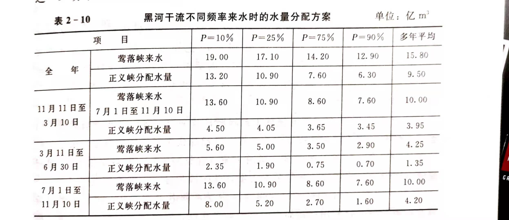

# 水权分配、管理及交易——理论、技术与实务
## 第一章 水权的基本概念
### 1.1 概念辨析
水权是产权的一种，我们所说的水权主要指==水资源的使用权==。水权属于物权范畴，是一种特殊的物权。
物权：公民、法人依法享有的直接支配特定物并对抗第三人的财产权利
用益物权：非所有人对他人之物所享有的占有、使用、收益的排他性权力。
水权与传统用益物权相比，在客体上存在差异：
- 传统用益物权的客体是不动产，水权客体是水资源，是流动的
- 传统用益物权的客体是单一物，水权客体水在形式上是作为集合物存在的
- 传统用益物权的客体为特定物，水权客体水是动态的、多功能的自然资源，地表水、地下水相互转换，主水、客水相互补充，难以特定化。

==水权==
- 最广义：包括水资源的所有权、使用权以及其他相关权。
- 广义：水资源稀缺条件下人民有关水资源的权利的综合，可以归纳为水资源的所有权、使用权和经营权
- 狭义：水资源使用权
- 最狭义：长期独占水资源使用权的权利。（所有权与使用权分离的结果）

==初始水权==：由国际初次界定的流域、河段截面获水域**可开发利用**水资源量的**初次分配**给各行政区开发利用的权限。初始水权花费应考虑流域自然地理特点、生态环境条件、行政区划、取用水的历史与习俗和经济社会发展的需求等因素。

### 1.2 产权的经济学理论及意义
现代产权经济学理论四大主线：
- 交易成本理论
  - 进入市场需要付出代价$\rightarrow$ 企业的存在
  - williamson(1985) 事先交易成本+事后交易成本
- 产权的效率分析理论
- 产权制度的选择和调整理论
- 用产权理论重新推断经济历史的产权制度演进理论（新经济史学说）

马克思认为：产权是**生产关系的法律体现**
> 科斯，1959，《联邦通讯委员会》: 只要产权不明确，外部性的侵害不可避免
> 科斯，1960，《社会成本问题》： 产权的明确界定是市场交易的前提。通过产权与外部性的关系可以衡量一种产权安排的效率。

==科斯定理==：
- 科斯第一定理：在交易费用为零的条件下，只要产权的初始界定明晰，通过市场交易综述可以导致资源的最优配置（帕累托最优）
- 科斯第二定理：如果交易费用大于零，那么不同的产权界定和分配会导致不同效率的资源配置。
- 政府的作业：明晰产权，通过个人协商使外部性尽可能内部化，然后交给市场去取得有效率的结果。

### 1.3 典型自然资源的产权制度
#### 1.3.1 土地资源
纯市场经济国家：都实行多重土地所有权制度。
美国：私人土地+联邦土地+州政府土地
永佃权：在他人土地上从事农业活动的权利。
我国现行土地产权制度：
- 土地所有权制度：全民所有制+劳动群众集体所有制
  - 国家土地所有权由国务院代表国家行使
  - 农民集体土地所有权依法分别属于乡（镇）农民集体、村农民集体、村内集体经济组织
  - 土地所有权可以在国家和农民集体之间进行变动
- 土地使用权制度：国家所有的土地和农民集体所有的土地可以依法确定给单位或个人使用，国家依法实行国有土地有偿、有期使用和出让、转让制度
- 土地承包经营权：集体经济组织的成员承包经营农民集体所有的土地，承包期限为30年；单位或个人承包经营国有土地或农民集体所有的土地，承包期限由契约确定

#### 1.3.2 矿产资源
我国矿产资源产权：
- 矿产资源所有权制度：矿产资源属于国家所有，不因依附的土地所有权或使用权改变，国务院是国家矿产资源所有权的代表。
- 探矿权和采矿权制度：（准物权） 勘探和开采矿产资源必须依法申请、经批准获得探矿权和采矿权，（有偿取得），勘查和开采过程中给他人财产造成损害的应依法补偿，依法批准后探矿权和采矿权可以转让。

#### 1.3.3 林业资源
我国林业产权：
- 林业资源所有权：森林资源属于国家所有，由法律规定属于集体所有的除外
- 林地、森林、林木使用权：国家队部分资源使用权实行有偿转让，部分权利可以依法转让或者作价入股
- 林地、森林、林木承包经营权：

#### 1.3.4 水资源
我国现有的水权制度主要是水资源所有权制度和取水权制度，水资源的使用权、收益权和处分权没有明确规定。（现在呢？2018.7）
取水权：向**水行政主管部门**或者**流域管理机构**申请领取取水许可证，并缴纳水资源费。有偿、有期、可转让。
## 第2章 国内外水权制度建设实践
### 2.1 国外典型水权制度建设
美国水使用许可制度：
1. 河岸水优先使用权：美国东部地区雨量较丰富，承认**与水流相邻的土地（河岸地）所有者**在其土地上有使用水的权利，但仅限于当时可用水量进行有限的用水，不得有对水质造成恶化的行为，不能影响其他河岸水使用者用水。
2. 优先占用水使用权：现占用者有优先使用权，水权与地权分离。在雨量缺乏的美国西部，优先占用水使用权只在“有效利用”的范围内才予以承认，取水需要进行取水许可审查，优先占用水使用权人在**一定时期内不使用水权即丧失权利**。
3. 混合制度：两种制度并存

水银行：在国家**水资源行政主管部门**宏观调控下建立的益水资源为服务对象的类似银行的企业化运作机构，主要是水资源买卖双方的一个**集中统一的购销中介机构**。（美国水银行：将每年来水量按照水权分成若干份，股份制形式管理）

智利水权所有者具备使用水资源并从中获利和处置水的权利，水权可以脱离土地交易，并可作为抵押品、附属担保品和置留权。

经验：
- 按水权配置水资源
- 按照优先用水原则进行水权分配
- 获取水权需要缴纳费用
- 规范水权转让和培育水市场
- 因地制宜建立切合实际的水权管理体系
- 水权管理有法律体系作保障
- 水权交易有公正的咨询服务公司作中介

澳大利亚水权体系主要由水资源产权关系、水量体积、保证率、可转让性及水质等组成（整理完善）
智利：政府尽量减少干预私有水权，完全市场化。主要有三种交易：农业用水户之间的短期交易、农业用水户之间的长期交易、农业用水户与城市之间的交易。水董事会于用水户协会协调配合两级管理架构。（典范，整理完善）
### 2.2 中国古代的水权机制——“均水制”与“时间水权”
地点：黑河流域
内容：每年芒种前封闭上端渠口10天，给下游镇夷五堡放水7天，后三天给毛、双二屯。

讨赖河分水制度：通过控制取水时间来控制分水，“定时不定量”，辅助以取水总量控制**少量分水**

==“时间水权”==：强稳定性、弱排他性、可转化性、可交易性

存在“春季借小水、夏季还大水”的现象。
### 2.3 中国现代的水权制度建设
==“87分水”==
计算所得黄河天然水资源量为563亿$m^3$，（1919-1980径流资料）
> 1984,《黄河水资源开发利用预测》：目前黄河流域设施供水能力达390亿$m^3$,占河川径流量的70%，但由于供水设施与土地资源分布不适应等原因，可利用的水量仅约294亿$m^3$（其中尚有190亿$m^3$，下游104亿$m^3$），为设施供水能力的75.4%，占河川径流量的52.5%，主要用水部门为农业，工业、城镇生活及农村人畜用水量占比例很小。目前，全河工农业总耗水量约270多亿$m^3$，其中农业灌溉耗水260多亿$m^3$，城镇、工业及农村人畜耗水约11$m^3$，现状总耗水量相当于黄河多年平均天然径流量的48%。（全国平均利用率为15.9%）   问题：（1）用水不合理，水浪费严重。（2）水量调节程度低，用水缺乏保障。（3）追求速度，不讲实效，不考虑水源条件。（4）缺乏统一管理。（5）水污染日益严重

分水原则：
- 优先保证人民生活用水和国家重点建设工业用水
- 黄河下游冲沙入海是黄河水资源平衡中需要优先考虑的问题（入海水量不少于200亿$m^3$）
- 保障农业灌溉用水
- 地下水原则上不增加开采量

水量分配方案：

1978年黄河水量分配方案    单位：亿$m^3$

| 省区 | 青海 | 四川 | 甘肃 | 宁夏 | 内蒙古 | 陕西 | 山西 | 河南 | 山东 | 津冀 | 合计 |
| ------ | ------ | ------ |------ | ------ | ------ |------ | ------ | ------ |------ | ------ | ------ |
| 年耗水量 | 14.1 | 0.4 | 30.4 | 40 | 58.6 | 38 | 43.1 | 55.4 | 70 | 20 | 370 |

黄河370亿$m^3$的可供水量，是按照保证率为50%的黄河径流计算的。

分配经验：
- 引水量与耗水量应当统一分配
  - 引水量：直接取水量
  - 耗水量：引水量中完全消耗掉的部分，通过蒸腾蒸发、土壤吸收、产品带走、居民和牲畜引用等多种途径**消耗**掉而不能回归到地表水体或者地下含水层的水量（相对稳定，但相对复杂）
- 地表水与地下水统一分配（甘肃石羊河上游截留地表水、下游开采地下水）

==黑河分水==
