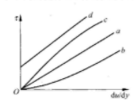

#  第一章 $\quad$绪论
##1.1流体的主要物理性质
**牛顿内摩擦定律**：流体沿某一固体表面作平行直线运动，流层间内摩擦力T的大小与流体性质有关，并与流速梯度$\frac{du}{dy}$和接触面积A成正比，而于接触面上的压力无关。用公式可以写为
$$
T=\mu A\frac{du}{dy}
$$
其中，$\mu$为比例系数，表征流体的粘滞性，称为**动力粘滞系数**或**动力粘度**，可简称为**粘度**，单位为$Pa\cdot s$
$$
\frac{du}{dy}=\frac{d\theta}{dt}
$$
可见，**速度梯度**就是流体微团中直角减小的速度，也称为**剪切变形速度**。
运动粘滞系数：
$$
\nu=\frac{\mu}{\rho}
$$
单位为$m^2/s$
气体粘性随温度升高而加大，液体粘性随温度升高而降低。
**理想流体**：没有粘滞性的流体
**牛顿流体**：流体运动的切应力于剪切变形速度的关系符合牛顿内摩擦定律

- b线流体：**膨胀性流体**，粘性系数随剪切变形的增大而增大，如淀粉浆等
- c线流体：**伪塑性流体**，粘性系数随剪切变形的增大而减小，如橡胶液等
- d线流体：**理想宾汉流体**，切应力达到某一数值时才开始发生剪切变形，且成线性关系。

**体积压缩系数**：
$$
\alpha_p=-\frac{\frac{dV}{V}}{dp}=\frac{\frac{d\rho}{\rho}}{dp}
$$
**体积弹性模量**：
$$
K=\frac{1}{\alpha_p}=\rho\frac{dp}{d\rho}
$$

##1.2作用在流体上的力
- ==质量力与流体的质量成正比==，常见质量力是重力和惯性力
- ==表面力与表面面积成正比==，由于流体内部不能承受拉力，所以表面力可以分为垂直于作用面的压力和平行于作用面的切力。

# 第二章 $\quad$流体静力学
## 2.1 流体静压强及其特性
流体静压强两个基本特性：
- 流体静压强的方向沿作用面的内法线方向
- 静止流体种任一点上流体静压强的大小与作用面的方位无关，即同一点上各个方向的流体静压强大小相等
## 2.2 流体平衡微分方程
流体微元所受质量力和表面力平衡：
$$
\frac{1}{\rho}\frac{\partial p}{\partial x}-\textbf{X}=0\\\frac{1}{\rho}\frac{\partial p}{\partial y}-\textbf{Y}=0\\\frac{1}{\rho}\frac{\partial p}{\partial z}-\textbf{Z}=0
$$
上式矢量形式为：
$$
\textbf{f}-\frac{1}{p}\nabla p=0\\
\nabla\equiv \textbf{i}\frac{\partial}{\partial x}+\textbf{j}\frac{\partial}{\partial y}+\textbf{k}\frac{\partial}{\partial z}
$$
**流体平衡微分方程综合式**：
$$
dp=\rho(\textbf{f} \cdot d\textbf{r})
$$

对于不可压缩均质流体($\rho=const)$,(3)式右边必是某一函数$W(x,y,z)$的全微分，即
$$
dW=Xdx+Ydy+Zdz
$$
故，
$$
X=\frac{\partial W}{\partial x},\qquad Y=\frac{\partial W}{\partial Y},\qquad Z=\frac{\partial W}{\partial z}
$$
称$W(x,y,z)$为==质量力势函数==，具有这样势函数的质量力成为有势的力。所以不可压缩均质流体只有在有势的质量力作用下才能维持平衡。

将（9）式带入得：
$$
dp=\rho dW\\p=\rho W+C\\p=p_0+\rho(W-W_0)
$$
**帕斯卡原理**：在平衡状态下，==常密度==流体中任一点的压强变化必将等值地传到流体的其他各点上。

**等压面**：静止流体中压强相等的各点所构成的面成为等压面。

## 2.3 重力场中液体静压强的分布

**流体静力学基本方程**：
$$
p=p_0+\rho gh
$$
只适用于质量力只有重力、同一物性的==静止==连续的液体

**绝对压强**：以没有气体存在的完全真空为零算起的压强值

**相对压强**：以当地大气压强作为压强计量的基准点计算而得的压强值，又称**表压强**或**计示压强**

**真空值**：将真空状态下的差值$p_a-p_{abs}$($p_a$为相对压强的参考值)称为真空值，真空值反映了接近绝对真空状态的程度，真空值越大，表示压强越低、越接近绝对真空状态。

压强的三种计量方法：

- 压强定义：$N/m^2(Pa)$
- 大气压的倍数：$1atm=101325Pa\approx 1\times 10^5 Pa$
- 液柱高度：$mH_2O/mmHg$ 真空值用液柱高度表示：$h_v=\frac{p_v}{\rho g}$

**水头**：

重力场中，有
$$
dp=-\rho gdz
$$

$$
dz+\frac{dp}{\rho g}=0
$$

积分后得：
$$
z+\frac{p}{\rho g}=C
$$
$z$为**位置水头**，$\frac{p}{\rho g}$为**压强水头**，$z+\frac{p}{\rho g}$为**测管水头**，z表示单位重量液体相对于基准面的位置势能，也称**位能**，$\frac{p}{\rho g}$表示单位重量液体相对于大气压强基准点所具有的压强势能，简称**压能**。

## 2.4 作用在平面上的液体总压力

**静压强分布图**是根据液体静力学基本方程和流体静压强的两个特性，绘出的受压面上哥带你的静压强大小及方向的图形。

静止液体作用于任意形状平面上的总压力等于该平面的面积与其形心点静压强的乘积。
$$
y_D=\frac{\rho gsin\alpha \int_Ay^2dA}{P}=\frac{I_{xo}}{y_CA}\\\because I_{xo}=I_{xC}+y_C^2A\\\therefore y_D=y_C+\frac{I_{xC}}{y_CA}
$$
矩形惯性矩为$\frac{bh^3}{12}$,圆形惯性矩为$\frac{\pi r^4}{4}$

**压力体**：整个曲面与其在自由液面（或自由液面的延长面）上的投影CD之间的柱体体积

**实压力体**：液体与压力体位于曲面的同一侧，对应压力分力方向向下

**虚压力体**：液体与压力体位于曲面的两侧，对应压力分力方向向上
$$
P_x=\rho gh_CA_x\\
P_z=\rho gV_p
$$
**阿基米德原理**：浸没在液体中的物体所受的液体总压力是一个铅垂力，大小等于物体同体积的液体重，作用线通过物体被浸没部分体积的几何中心。

# 第三章 流体运动学

## 3.1 流体运动的描述方法

##### 拉格朗日法：

即质点系法，跟踪每个流体质点的运动全过程，记录它们的位移的时间历程，用流体质点在初始时刻$t=t_0$的空间位置坐标$(a,b,c)$作为区分不同流体质点的标记。a,b,c称为**拉格朗日变量**

##### 欧拉法：

空间点法，一种场的描述方法，也叫==流场法==，在选定的空间点上观察流经它的流体质点的运动情况，将空间点位置坐标(x,y,z)和时间t称为**欧拉变量**（相比拉格朗日变量多时间t）

流体质点加速度：（仅记载欧拉法）
$$
\textbf{u}=\textbf{u}[x(t),y(t),z(t),t]\\\textbf{a}=\frac{d\textbf{u}}{dt}=\frac{\partial u}{\partial t}+u_x\frac{\partial\textbf{u}}{\partial x}+u_y\frac{\partial\textbf{u}}{\partial y}+u_z\frac{\partial\textbf{u}}{\partial z}
$$
即：
$$
\textbf{a}=\frac{\partial \textbf{u}}{\partial t}+(\textbf{u}\cdot \nabla)\textbf{u}\\\nabla\equiv \textbf{i}\frac{\partial}{\partial x}+\textbf{j}\frac{\partial}{\partial y}+\textbf{k}\frac{\partial}{\partial z}
$$
故，加速度分为**时变加速度**和**位变加速度**
$$
\frac{d}{dt}=(\frac{\partial}{\partial t}+\textbf{u}\cdot\nabla)
$$
==时变导数是由流场随时间变化的不恒定性引起的，而位变导数是由流场随空间变化的不均匀性引起的==

## 3.2 有关流场的几个基本概念

**恒定流**：流场中各空间点上的任何运动要素均不随时间变化。否则为**非恒定流**

**迹线**是流体质点运动的轨迹（与拉格朗日观点相对应的概念）
$$
\frac{dx}{u_x[x(t),y(t),z(t),t)]}=\frac{dy}{u_y[x(t),y(t),z(t),t)]}=\frac{dz}{u_z[x(t),y(t),z(t),t)]}=dt
$$
**流线**是流速场的矢量线，是某瞬时对应流场中的一条曲线，该瞬时位于曲线上的流体质点速度矢量都和该曲线相切（与欧拉观点相对应）
$$
\textbf{u}\times d\textbf{l}=0\\\frac{dx}{u_x(x,y,z,t)}=\frac{dy}{u_y(x,y,z,t)}=\frac{dz}{u_z(x,y,z,t)}
$$
在恒定流情况下，迹线与流线重合。

**流管**：在流场中，取一条==不与流线重合==的封闭曲线L，在同一时刻过L上每一点作流线，由这些流线围成的管状曲面称为**流管**。（瞬时概念）

**过流断面**：与流动方向正交的流管的横断面为**过流断面**

**元流管**：过流断面为面积委员的流管，其中的流动称为**元流**。

**总流**：过流断面为有限面积的流管中的流动叫**总流**

**流量**：通过流场中某曲面A的流速通量(也称**体积流量**)
$$
Q=\iint_A\bold{u}\cdot\bold{n}dA
$$
**质量流量**：
$$
Q=\iint_A\rho\bold{u}\cdot\bold{n}dA
$$
**断面平均流速**：
$$
v=\frac{Q}{A}
$$
**均匀流**：位变导数为零的流场中的流动，否则为**非均匀流**，速度矢量沿着流线不变（互相平行的直线）

**渐变流**：接近于均匀流的流动

**系统**：由确定的流体质点组成的集合称为**系统**（拉格朗日方法）

**流体微团**：从有限体积的运动流体团中隔离出来，在空间只占据一个体积微元、具有线性尺度效应的流体团

**控制体**：有流体流过的固定不变的空间区域称为**控制体**，其边界叫控制面（欧拉方法）

## 3.3 流体微团运动的分析

亥姆霍兹速度分解定理
$$
\bold{\hat{u}}=\bold{u}+\bold{\varepsilon \cdot}d\bold{r}+\bold{\omega\times}d\bold{r}\\
\varepsilon=\begin{bmatrix}\varepsilon_{xx}&\varepsilon_{xy}&\varepsilon_{xz}\\\varepsilon_{yx}&\varepsilon_{yy}&\varepsilon_{yz}\\\varepsilon_{zx}&\varepsilon_{zy}&\varepsilon_{zz}\end{bmatrix}=\begin{bmatrix}\frac{1}{2}(\frac{\partial u_x}{\partial x}+\frac{\partial u_x}{\partial x})&\frac{1}{2}(\frac{\partial u_x}{\partial y}+\frac{\partial u_y}{\partial x})&\frac{1}{2}(\frac{\partial u_x}{\partial z}+\frac{\partial u_z}{\partial x})\\\frac{1}{2}(\frac{\partial u_y}{\partial x}+\frac{\partial u_x}{\partial y})&\frac{1}{2}(\frac{\partial u_y}{\partial y}+\frac{\partial u_y}{\partial y})&\frac{1}{2}(\frac{\partial u_y}{\partial z}+\frac{\partial u_z}{\partial y})\\\frac{1}{2}(\frac{\partial u_z}{\partial x}+\frac{\partial u_x}{\partial z})&\frac{1}{2}(\frac{\partial u_z}{\partial y}+\frac{\partial u_y}{\partial z})&\frac{1}{2}(\frac{\partial u_z}{\partial z}+\frac{\partial u_z}{\partial z})\end{bmatrix}\\
\bold{\omega}=(\omega_x,\omega_y,\omega_z)=\begin{bmatrix}\frac{1}{2}(\frac{\partial u_z}{\partial y}-\frac{\partial u_y}{\partial z})&\frac{1}{2}(\frac{\partial u_x}{\partial z}-\frac{\partial u_z}{\partial x})&\frac{1}{2}(\frac{\partial u_y}{\partial x}-\frac{\partial u_x}{\partial y})\end{bmatrix}
$$

$$
\varepsilon_{xx}=\frac{\partial u_x}{\partial x}
$$
$\varepsilon_{xx}$表征了x方向的**线变形速率**，$\varepsilon_{yy},\varepsilon_{zz}$同理

$\varepsilon_{xy}$表征了Oxy坐标面上流体直角减小速率的一半，称为**变形速率**，$\varepsilon_{yy},\varepsilon_{zz}$同理

$\omega_{z}$表征了直角平分线的旋转速率，$\omega_{y},\omega_{z}$同理

流体微团可以分为平移、转动和变形三种形式。

把$\omega=0$或$\nabla\times u=0$的流动称为**无旋流动**，反之称为**有旋流动**

即：
$$
\frac{\partial u_z}{\partial y}=\frac{\partial u_y}{\partial z},\qquad \frac{\partial u_x}{\partial z}=\frac{\partial u_z}{\partial x},\qquad \frac{\partial u_y}{\partial x}=\frac{\partial u_x}{\partial y} 
$$
无旋流动必然存在一个数量场$\varphi(x,y,z)$，满足：
$$
d\varphi=u_xdx+u_ydy+u_zdz\\\nabla \varphi=\bold{u}
$$
这个数量场为**流速场的势函数**，简称**速度势**，因此无旋流动的流速场必有速度势，所以无旋流动也成为**有势流动**

## 3.4 连续性方程

**三维流动连续性微分方程**：
$$
\frac{\partial \rho}{\partial t}+\nabla \cdot(\rho\bold{u})=0\\\nabla \cdot(\rho\bold{u})=\frac{\partial(\rho u_x)}{\partial x}+\frac{\partial(\rho u_y)}{\partial y}+\frac{\partial(\rho u_z)}{\partial z}
$$

**恒定总流的连续性方程**：
$$
\iint_{A_1}\rho udA=\iint_{A_2}\rho udA
$$
若流体不可压，$\rho=const$，即$Q_1=Q_2$

# 第四章 流体动力学基础

## 4.1 运动流体的应力状态

在运动的流体中，既可能有压应力有可能有切应力，把流体在运动状态下的压应力叫做流体动压强。

应力张量：
$$
\bold{P}=\begin{bmatrix}p_{xx}&p_{xy}&p_{xz}\\p_{yx}&p_{yy}&p_{yz}\\p_{zx}&p_{zy}&p_{zz}\end{bmatrix}
$$
应力张量主对角线上三个元素之和$p_{xx}+p_{yy}+p_{zz}$是坐标变换中的不变量，其值不随坐标轴的转动而改变，定义**流体动压强**：
$$
p=-\frac{1}{3}(p_{xx}+p_{yy}+p_{zz})
$$
将应力张量写成：
$$
\bold{P}=\begin{bmatrix}p_{xx}+p&p_{xy}&p_{xz}\\p_{yx}&p_{yy}+p&p_{yz}\\p_{zx}&p_{zy}&p_{zz}+p\end{bmatrix}-p\begin{bmatrix}1&0&0\\0&1&0\\0&0&1\end{bmatrix}\\=\bold{D}-p\bold{\delta}
$$
称D为偏应力张量，主对角线上三个元素为**粘性附加法应力**,其他为切应力

偏应力张量完全是由粘性引起的

==各向同性的不可压缩牛顿流体==的应力和变形速率之间存在线性关系：(**广义牛顿内摩擦定律**)
$$
\bold{P}=2\mu\varepsilon-p\delta\\\bold{D}=2\mu\varepsilon
$$

## 4.2 流体运动微分方程

**以应力表示的流体运动方程**：
$$
\frac{du_x}{dt}=\bold{X}+\frac{1}{\rho}(\frac{\partial p_{xx}}{\partial x}+\frac{\partial p_{yx}}{\partial y}+\frac{\partial p_{zx}}{\partial z})\\\frac{du_y}{dt}=\bold{Y}+\frac{1}{\rho}(\frac{\partial p_{xy}}{\partial x}+\frac{\partial p_{yy}}{\partial y}+\frac{\partial p_{zy}}{\partial z})\\\frac{du_z}{dt}=\bold{Z}+\frac{1}{\rho}(\frac{\partial p_{xz}}{\partial x}+\frac{\partial p_{yz}}{\partial y}+\frac{\partial p_{zz}}{\partial z})
$$
对于==各向同性的不可压缩牛顿流体==，**不可压粘性流体运动方程(**N-S方程）：
$$
\frac{d\bold{u}}{dt}=\frac{\partial \bold{u}}{\partial t}+(\bold{u}\cdot\nabla)\bold{u}=f-\frac{1}{\rho}\nabla p+\nu\nabla^2\bold{u}\\\nabla^2\equiv \frac{\partial^2}{\partial x^2}+\frac{\partial^2}{\partial y^2}+\frac{\partial^2}{\partial z^2}
$$

对于理想流体，$\nu=0$，运动微分方程简化为：（**理想流体运动方程/欧拉方程**）
$$
\frac{d\bold{u}}{dt}=\frac{\partial \bold{u}}{\partial t}+(\bold{u}\cdot\nabla)\bold{u}=f-\frac{1}{\rho}\nabla p
$$

## 4.3 理想流体恒定元流的能量方程

$$
W-\frac{p}{\rho}-\frac{u^2}{2}=C_l
$$

在理想流体的恒定流动中，同一流线上各点的$W-\frac{p}{\rho}-\frac{u^2}{2}$值是一个常数。其中，W为质量力势函数，不同流线可以有各自的积分常数，上式称为**伯努利积分**(理想、恒定、不可压、质量力有势)

对于质量力仅为重力的情况下，$W=-gz$，故有，
$$
gz+\frac{p}{\rho}+\frac{u^2}{2}=C_l
$$
若在伯努利积分条件基础上加上无旋条件，则可得**欧拉积分**：
$$
W-\frac{p}{\rho}-\frac{u^2}{2}=C\\z+\frac{p}{\rho g}+\frac{u^2}{2g}=C_l
$$
$z,\frac{p}{\rho g},\frac{u^2}{2g}$三项分别表征了单位重量流体具有的**位置势能**，**压强势能**，**动能**，（位置水头、压强水头、速度水头）

## 4.4 恒定总流能量方程的推导

$$
z_1+\frac{p_1}{\rho g}+\frac{\alpha_1v_1^2}{2g}=z_2+\frac{p_2}{\rho g}+\frac{\alpha_2v_2^2}{2g}+h_{w1-2}
$$

应用条件：

- 流动必须是恒定流，且流体不可压缩
- 作用于流体上的质量力只有重力
- 两断面应在渐变流段中
- 两端吗间没有能量的输入或输出，没有流量的流入或流出

将水头线的斜率称为**水力坡度**：
$$
J=-\frac{dH}{ds}=\frac{dh_w}{ds}
$$
文透里管：

$$
Q_{实}=\mu K\sqrt{\Delta h}\\K=\frac{\pi}{4}\frac{d_1^2d_2^2}{\sqrt{d_1^4-d_2^4}}\sqrt{2g}
$$

$$
z_1+\frac{p_1}{\rho g}+\frac{\alpha_1v_1^2}{2g}+H_m=z_2+\frac{p_2}{\rho g}+\frac{\alpha_2v_2^2}{2g}+h_{w1-2}
$$

对于水泵管路系统，$H_m$取+号，是单位重量的水通过水泵之后增加的能量，称为**水泵扬程**

对于水轮机管路系统，$H_m$取-号，是单位重量的水给予水轮机的能量，称为**水轮机的作用水头**

水泵的轴功率$N_p$：
$$
N_p=\frac{\rho gQH_m}{\eta_p}
$$
水轮机的功率：
$$
N_t=\eta_t\rho gQH_m
$$

## 4.5 恒定总流的动量方程

恒定总流三大方程：==动量方程、能量方程、连续性方程==

动量守恒原理：
$$
\iint_{A_2}\rho u\bold{u}dA-\iint_{A_1}\rho u\bold{u}dA=\sum \bold{F}
$$
**动量修正系数**：
$$
\alpha_0=\frac{\iint_Au^2dA}{v^2A}
$$
故有：
$$
\rho Q(\alpha_{02}v_2-\alpha_{01}v_1)=\sum F
$$

# 第五章 有旋流动和有势流动

## 5.1 有旋流动

定量描述有旋流动的物理量为**涡量$\Omega$** ,即速度矢量的旋度：
$$
\Omega=\nabla\times\bold{u}=2\omega
$$
流场中某点涡量的大小是以该点为基点的流体微团绕该点的平均旋转角速度的两倍，涡量的==方向与微团的瞬时转动轴重合==。

**涡线**：涡量场的矢量线（曲线上每一点的涡量与该曲线相切），即：
$$
\Omega\times d\bold{l}=0\\\frac{dx}{\Omega_x(x,y,z,t)}=\frac{dy}{\Omega_y(x,y,z,t)}=\frac{dz}{\Omega_z(x,y,z,t)}
$$
**涡管**：类似流管，取一条不与涡线重合的封闭曲线L，由曲线L上每一点的涡线围成的管状曲面称为**涡管**（若在涡管周围流体的涡量均为零，则称该涡管为**孤立涡管**）（瞬时概念）
$$
I=\iint_A\Omega\cdot\bold{n}dA
$$
简称为**涡通量**。通过涡管中任一截面的涡通量称为该涡管的涡管强度。

**速度环量**：速度矢量**u**沿着有向曲线AB的线积分：
$$
\Gamma_{AB}=\int_{AB}\bold{u}\cdot d\bold{L}\\\Gamma_{AB}=\int_{AB}u_xdx+u_ydy+u_zdz
$$
**斯托克斯定理**：沿包围单连通面域的有限封闭围线的速度环量等于通过此单连通面域的涡通量
$$
\oint_L\bold{u}\cdot d\bold{L}=\iint_A\Omega\cdot ndA
$$
==单连通面域==：该连通面域中任何围线均可连续收缩成一点而不越过边界

直角坐标系：
$$
\oint_Lu_xdx+u_ydy+u_zdz\\=\iint_A(\frac{\partial u_z}{\partial y}-\frac{\partial u_y}{\partial z})dydz+(\frac{\partial u_x}{\partial z}-\frac{\partial u_z}{\partial x})dydz+(\frac{\partial u_y}{\partial x}-\frac{\partial u_x}{\partial y})dydz
$$
双连通区域的推广：
$$
\iint_A\Omega\cdot ndA=\Gamma_C-\Gamma_L
$$

沿涡管外任一围绕涡管的封闭曲线的速度环量等于该孤立涡管的涡管强度。

**涡管强度守恒定理**：在同一时刻，同一涡管上任一截面的涡通量即涡管强度保持不变

涡管存在的形式只可能有以下两种：

- 本身成封闭形
- 涡管的两端位于流体边界面（自由表面或固体表面）上，或伸展到无限远

**流体线**：在运动中始终由某些确定流体质点所组成的线

旋涡随时间的变化率：
$$
\frac{d\Gamma}{dt}=\oint_L \frac{d\bold{u}}{dt}\cdot d\bold{L}
$$
**开尔文环量定理**（又称汤姆逊定理）：在质量力==有势==（质量力沿封闭曲线积分为零）、==正压==（内部任一点的压力只是==密度的函数==的流体）理想流体的流动中，沿任一封闭流体线的速度环量不随时间变化

速度环量随时间变化的三个因素：

- 质量力无势
- 流体斜压
- 粘性作用

**旋涡扩散现象**：由于粘性的作用，旋涡会从旋涡强度大的地方向旋涡强度小的地方输移。

## 5.2 旋涡的诱导速度

**旋涡的诱导速度**是孤立的旋涡带动周围无界不可压缩流体运动的速度

在分析诱导速度分布时用速度连续假设来代替粘性作用，并仍将实际流体当作理想流体来处理。

**毕奥-萨伐公式**：微元段对任一点A所诱导的速度为：
$$
d\bold{u}=\frac{\Gamma}{4\pi}\frac{d\bold{L}\times r}{r^3}
$$
整个曲线涡对A点的诱导速度：
$$
|u|=\frac{\Gamma}{4\pi}\int_L\frac{rdLsin\alpha}{r^3}=\frac{\Gamma}{4\pi}\int_L\frac{sin\alpha dL}{r^2}
$$

单个直线涡：
$$
|u|=\frac{\Gamma}{4\pi}\int_A^B\frac{sin\theta dL}{r^2}=\frac{\Gamma}{4\pi R}(cos\theta_1-cos\theta_2)
$$
涡系独立作用原理：

- 涡系决定的诱导速度场是每一个涡诱导速度的几何和
- 每一个涡的运动速度等于其他涡在该涡心上的诱导速度几何和

第k个直线涡在M点引起的诱导速度$u_k$在x,y轴方向的分量，即：
$$
u_{kx}=\frac{\Gamma_k}{2\pi r_k}(-\frac{y-y_k}{r_k})\\u_{ky}=\frac{\Gamma_k}{2\pi r_k}(\frac{x-x_k}{r_k})
$$
**兰肯涡**：一种平面组合涡，中心部分是以涡心为圆心的圆，其中的速度与离涡心的距离成正比，涡量为常数。外围部分的速度则与离涡心的距离成反比，==流动有势==，==涡量为零==。中心部分是**强迫旋涡**，需有外力不断推动。中心部分也可以用==圆柱形的刚体的转动==代替。外围部分流动成为**自由旋涡**，在流动稳定以后，无须加入能量。

兰肯涡压强分布：
$$
p=p_{\infty}+\frac{\rho\omega^2}{2}r^2-\rho\omega^2r_0^2\qquad (r\leq r_0)\\ p=p_{\infty}-\frac{\rho\Gamma^2}{8\pi^2 r^2}\qquad (r\geq r_0)
$$

## 5.3 卡门涡街

**卡门涡街**：当恒定流绕过某些物体时，在一定条件下，物体两侧周期性地脱落出旋涡，使物体后面形成旋转方向相反、并有规则交错排列的双列线涡。开始时，这两列线涡分别保持自身的运动奇纳金，接着它们互相干扰，互相吸引形成涡街。

形成于雷诺数$Re=\frac{Ul}{\nu}$有关，U为来流速度，l为物体的特征长度（圆柱体为直径d），$\nu$为流体运动粘滞系数。

## 5.4 有势流动

**速度势函数**是与空间及时间有关的标量函数，即$\bold{u}=\nabla \varphi$ 
$$
d\varphi=\bold{u}\cdot ds
$$

- $\varphi$可加上任意常数而不影响对流速场的描述
- 满足$\varphi$为常数的曲面称为等势面，法线方向即为$\nabla \varphi$的方向和速度矢量的方向重合
- 在单连域中任意两点A、B的速度势之差等于沿两点之间任意曲线的速度环量
- 在不可压缩流体中，速度势满足拉普拉斯方程

$$
\nabla^2\varphi=\Delta\varphi=\frac{\partial^2 \varphi}{\partial x^2}+\frac{\partial^2 \varphi}{\partial y^2}+\frac{\partial^2 \varphi}{\partial z^2}=0
$$

- 速度势函数在不可压缩流体==内部==不可能有极大值或极小值

**流函数**：（不可压缩流体平面流动）：
$$
d\psi=u_xdy-u_ydx
$$

- $\psi$可加上任意常数而不影响对流速场的描述
- 等流函数线是流线，等流函数的切线方向与速度矢量方向一致
- 任意两流线间的流量等于这两条流线的流函数值之差
- 在有势流动中中，流函数满足拉普拉斯势函数
- 在流体==内部==不可能有极大值或极小值

在不可压缩平面势流中速度势函数和流函数同时存在，且满足以下条件：(**柯西-黎曼条件**)
$$
u_x=\frac{\partial \varphi}{\partial x}=\frac{\partial \psi}{\partial y}\\u_y=\frac{\partial \varphi}{\partial y}=\frac{\partial \psi}{\partial x}
$$

- 等势线与等流函数线相正交

$$
  W(z)=\varphi(x,y)+i\psi(x,y)
$$

称为**复势**，一个确定的复势代表一个不可压缩平面势流

## 5.6 流网的特征及其近似绘制法

**流网**：由一族等势线和一组等流函数线（即流线）构成的正交网络叫流网

## 5.8 势流叠加原理及其举例

几个简单势流可以叠加起来得到较复杂的势流，它的速度势等于被叠加的简单势流的速度势之和。

  

  

  

# 第六章  流动阻力和能量损失
## 6.1 流动阻力和能量损失的两种形式
**沿程阻力**：在边界沿程不变（包括边壁形状、尺寸、流动方向均不变）的均匀流段上，流动阻力只有沿程不变的摩擦阻力，称为==沿程阻力==，克服沿程阻力产生的能量损失称为==沿程损失==。

达西和魏斯巴赫提出计算圆管沿程水头损失的公式(**达西公式**）：
$$
h_f=\lambda \frac{l}{d}\frac{v^2}{2g}
$$
对于气体管道，用压强损失表示沿程损失，上式可改为：
$$
p_f=\lambda \frac{l}{d}\frac{\rho v^2}{2}
$$
其中，$\lambda$为沿程损失系数。

**局部阻力**：在边界形状沿程急剧变化，流速分布急剧调整的局部区段上，集中产生的流动阻力称为==局部阻力==，克服局部阻力产生引起的能量损失称为==局部损失==。

局部损失计算公式：
$$
h_j=\zeta\frac{v^2}{2g}
$$
写成压强损失的形式：
$$
p_j=\zeta\frac{\rho v^2}{2}
$$

整个管道的水头损失：
$$
h_w=\sum h_f+\sum h_j
$$

## 6.2 粘性流体的两种流态
当流速较小时，水头损失与流速一次方成正比，速度较大时，水头损失与流速平方成正比。

**层流**：各流层之间毫不相混，分层有规则的流动状态称为==层流==，各层流体质点剧烈掺混的状态称为==紊流==。

**上下临界速度**：由层流转为紊流的速度临界值记为$v_c'$，由紊流转为层流的速度临界值记为$v_c$，分别称为==上临界流速==和==下临界流速==。下临界流速小于上临界流速，并且下临界流速是稳定的，而上临界流速受起始条件和实验条件影响较大，因此以后的临界流速指下临界流速。

雷诺数：
$$
Re=\frac{vd\rho}{\mu}=\frac{vd}{\nu}
$$
临界雷诺数$Re_c=2000$，（仔细测量为2320）

非圆管道：
==水力半径==：
$$
R=\frac{A}{\chi}
$$
R为水力半径，A为过流断面面积，$\chi$为过流断面上流体与固体边界接触部分的周长，称为**湿周**。

矩形断面明渠流动的水力半径为
$$
R=\frac{A}{\chi}=\frac{bh}{b+2h}
$$
以水力半径为特征长度，相应的临界雷诺数为
$$
Re_{cR}=\frac{vR}{\nu}=500
$$
雷诺数反映了惯性力与粘滞力作用的对比关系，当$Re\lt Re_c$时，粘性对流动起主导作用，随着Re增加，粘性作用减弱，惯性对紊动的激励作用增强。

## 6.3 沿程损失与切应力之间的关系
取圆管中恒定均匀流段，平衡方程式：
$$
p_1A-p_2A+\rho glcos\alpha-\tau_0\chi l=0
$$
将$lcos\alpha=z_1-z_2$代入上式，整理得：
$$
(z_1+\frac{p_1}{\rho g})-(z_2+\frac{p_2}{\rho g})=\frac{\tau_0\chi l}{\rho gA}
$$
故
$$
h_f=\frac{\tau_0\chi l}{\rho gA}=\frac{\tau_0l}{\rho gR}
$$
或
$$
\tau_0=\rho gR\frac{h_f}{l}=\rho gRJ
$$
(该方程对层流和紊流均适用)(**均匀流基本方程**)
过流断面上切应力分布：
$$
\tau=\frac{r}{r_0}\tau_0
$$
$$
\tau_0=\rho gRJ=\rho g\frac{d}{4}\frac{h_f}{l}=\rho g\frac{d}{4}\lambda \frac{1}{d}\frac{v^2}{2g}=\rho \frac{\lambda}{8}v^2
$$
则
$$
\sqrt{\frac{\tau_0}{\rho}}=v\sqrt{\frac{\lambda}{8}}
$$
定义$v_*=\sqrt{\frac{\tau_0}{\rho}}$，$v_*$具有速度的量纲，是反映壁面切应力大小的一个流速，故称==阻力速度==/==摩阻速度==
于是
$$
v_*=v\sqrt{\frac{\lambda}{8}}
$$
下面进入到层流和紊流的阻力规律与沿程损失计算。
## 6.4 圆管中的层流运动
各流层间切应力服从牛顿内摩擦定律：
$$
\tau=\mu\frac{du}{dy}
$$
式中，$y=r_0-r$，则：
$$
\tau=-\mu\frac{du}{dr}
$$
$$
-\mu\frac{du}{dr}=\rho g \frac{r}{2}J\\du=-\frac{\rho g J}{2\mu}rdr\\u=-\frac{\rho gJ}{4\mu}r^2+C\\边界条件：r=r_0,u=0\\u=\frac{\rho gJ}{4\mu}(r_0^2-r^2)\\u_{max}=\frac{\rho gJ}{4\mu}r_0^2
$$
平均流速为：
$$
v=\frac{1}{2}u_{max}
$$
圆管层流运动的动能修正系数$\alpha$和动量修正系数$\alpha_0$分别为2和1.33
$$
h_f=\frac{32\mu lv}{\rho gd^2}=\frac{64}{Re}\frac{l}{d}\frac{v^2}{2g}
$$

## 6.5 紊流运动简介

**脉动**：流体质点在流动过程中不断相互**掺混**，质点掺混使得流场中固定空间点上的各种运动要素，如流速、压强、浓度等随时间不断波动，这种波动称为**脉动**。

特点：

- 随机性
- 三维性（沿主流流动方向脉动量最大，垂直于主流流动方向又垂直于固体壁面方向的脉动量最小）
- 数值有时候很大

时间平均法将紊流视为**时间平均流动**和**脉动流动**的叠加
$$
u_x=\bar{u_{x}}+u_x'\\\bar{u_x}=\frac{1}{T}\int_0^Tu_xdt\\\frac{1}{T}\int_0^Tu_x'dt=0
$$

$$
\bar{u_x'^2}=\frac{1}{T}\int_0^Tu_x'^2dt
$$

紊流强度N：
$$
N=\frac{\sqrt{\frac{1}{3}(\bar{u_x'^2}+\bar{u_y'^2}+\bar{u_z'^2})}}{\bar{u_x}}
$$
同理：
$$
p=\bar{p}+p'
$$
紊流切应力：

- 时均粘性切应力：

$$
  \bar{\tau_1}=\mu\frac{d\bar{u_x}}{dy}
$$

- 紊流附加切应力

$$
\bar{\tau_2}=-\rho\overline{u_x'u_y'}
$$

$$
\overline{\tau}=\overline{\tau_1}+\overline{\tau_2}=\mu\frac{d\overline{u_x}}{dy}-\rho\overline{u_x'u_y'}
$$

混合长度理论：
$$
\overline{\tau_2}=\rho l^2(\frac{d\overline{u_x}}{dy})^2\\\overline{\tau}=\overline{\tau_1}+\overline{\tau_2}=\mu\frac{d\overline{u_x}}{dy}+\rho l^2(\frac{d\overline{u_x}}{dy})^2
$$
雷诺数较小时，前者占主导地位，雷诺数较大时，前者可忽略不计。

普朗特假定：

- 壁面附近切应力等于壁面上的切应力
- 混合长度l与质点到壁面的距离y成正比。$l=\kappa y$

$$
du=\frac{1}{\kappa}\sqrt{\frac{\tau_0}{\rho}}\frac{dy}{y}\\u=\frac{v_*}{\kappa}lny+C
$$

$v_*=\sqrt{\frac{\tau_0}{\rho}}$为常数

紊流分区：

- **粘性底层**：紧靠壁面存在一个以粘性切应力为主导作用的薄层
- **紊流核心**：边壁不远处到管中心的绝大部分区域流速分布比较均匀，以紊流附加切应力起主导作用
- **过渡层**：紊流核心与粘性底层之间，范围很小

粘性底层理论厚度：
$$
\delta_0=11.6\frac{\nu}{v_*}=11.6\frac{\nu}{v\sqrt{\frac{\lambda}{8}}}=\frac{32.8d}{Re\sqrt{\lambda}}
$$
