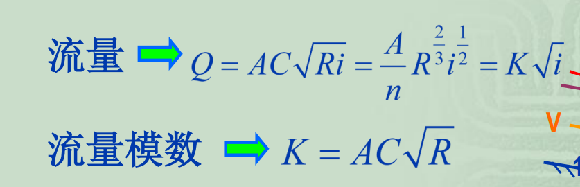
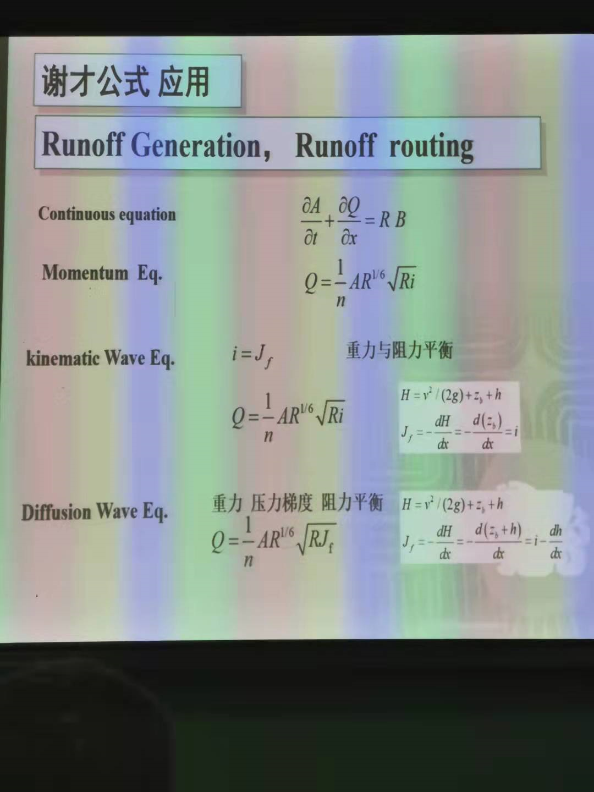
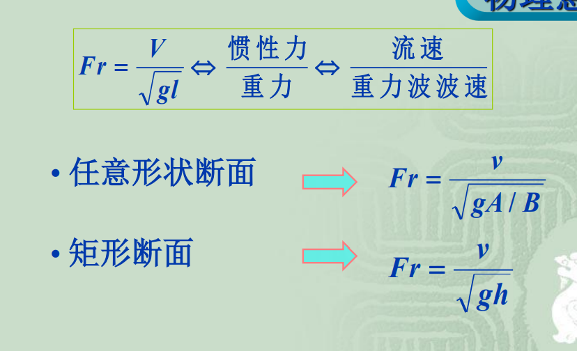

# C1 明槽中的恒定均匀流

明槽均匀流的水力特征：
- h,v,,A 流速u 分布沿程不变
- 匀速直线运动 （Gsin$\theta$ =F）
- 正常水深：形成均匀流时的水深

形成条件：
- 恒定流
- Q沿程不变
- 棱柱型槽
- i和n沿程不变
- i>0

运动波与扩散波：

**水力最优断面**：过流断面的面积一定，通过的流量最大的断面形状

J、$J_f$、i：
- i:位置水头坡度
- J：总水头坡度
- $J_f$:压强水头坡度

均匀流条件：$J_f=i$

即：h不变，$h_0$

# C2 明槽中恒定非均匀渐变流
==急流/缓流==：高于临界水深为缓流，低于临界水深为急流。（判别：弗劳德数，阈值：1）

临界水深L:微波波速等于水流流速  （微波波速：$v=\sqrt{gh}$  ，对应水深$h_c$​）

弗劳德数：$Fr=\frac{V}{\sqrt{gl}}$

