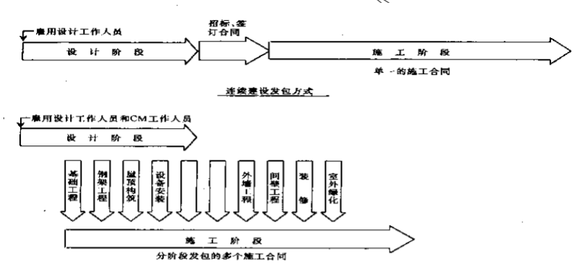

#第1讲 项目管理的拓展与企业能力建设
##1. 理解本质：资源集成
- 1965年，以欧洲国家为主的一些国家成立了一个组织——“国际项目管理协会”（international project management association,IPMA）
  - 推出BOK（body of knowledge）
  - a,b,c,d四级证书，从计划经理、项目经理、直到专业人员和技术员。
- 1969年，美国成立了“项目管理学会”（project management institute,PMI）
  - 推出项目管理知识体系指南（project management body of knowledge,PMBOK）
  - 项目管理专业人员认证（PMP），只有一个级别
- C-PMBOK已起步

项目管理--==最有效地整合资源高效地实现目标的理念和技术==
- 从**管理内容**上设计三个**层次**：==项目层、项目组层、投资组合层==
- 从**集成资源**上包括三个**级别**：==项目级、组织级、多组织级==
- 从**企业的管理模式**上分为两个**层面**：==管理好单个项目、基于项目的管理/组织级项目管理/企业项目管理==

干系人层资源集成-项目管理模式
- ==传统的项目管理模式==
- ==建设管理模式==（Construction Management Approach,CM）
- ==设计-建造（Design-Build）与交钥匙（Turnkey）工程模式==
- ==设计管理模式（Design-Manage）==
- ==BOT模式==

组织层资源集成-当事人的组织模式：
- ==职能型组织==
- ==强矩阵型组织==
- ==项目型组织==

##2. 广泛应用与紧迫的形势
**实质**：在复杂多变的环境中如何做好一件事
项目经理的众任：
    竞争的加剧、利润的走薄和产品更新换代的加快，要求以项目为单元精细管理，即所谓基于项目的企业管理
    随着企业管理模式向以项目为经营单元的转职，**项目经理**成为实现企业目标的责任人，而**职能经理**变为确保项目实施的服务者（完成具体工作和从专业知识角度的把关）
##3. 浅谈项目管理
    管理：是==预测和计划、组织、指导、协调和控制。==**预测和计划**指预测未来并制定行动计划；**组织**指建立二元的结构、材料和人员；**协调**统一步伐、团结一致；**控制**指使一切事项按原定标准和指令实现。
预测：需求、风险
    更新计划：在节点靠近后，使进程向原路线（计划）靠近，==不变性==，成熟技术、成熟做法、成熟流程去保证，而不是去靠随机性的创新。
什么是项目管理？
>项目管理是将知识、技能、工具和技术应用于项目活动以满足项目干系人对项目的要求。———PMBOK-2000版

WBS: work breakdown system
OBS: organization breakdown system
ABS: account breakdown system
- 目标体系作为考核进度的标准
- ==任务-岗位-钱==
- 以计划为核心 以进度为主线
- 在节点上做考核
- 责任方
- 奖惩体系
- 以三角形体系为静态考核标尺，以上方的注意点作为标尺使用说明（注意点）

从文化角度考虑，单项目管理有利己文化导引，组织级以制度去约束私欲的扩张（利他文化）
项目里的知识：从单项目提炼出资产，组织级成为项目资产，公司内部为公司制度，行业范围为行业标准，上升到国家则为法律法规，改善项目实施环境来构建==利他文化==

##4. 项目管理成熟度与能力建设
###4.1 OPM3的作用
- 通过内部的纵向比较、评价，找出组织改进的方向。
- 通过外部的横向比较，提升组织在市场中的竞争力。
- 商家通过评价、改进，提升企业形象。
- 雇主利用OPM3要求商家达到某级成熟度，以便选择更有能力的投标人，并作为一种项目控制的手段

