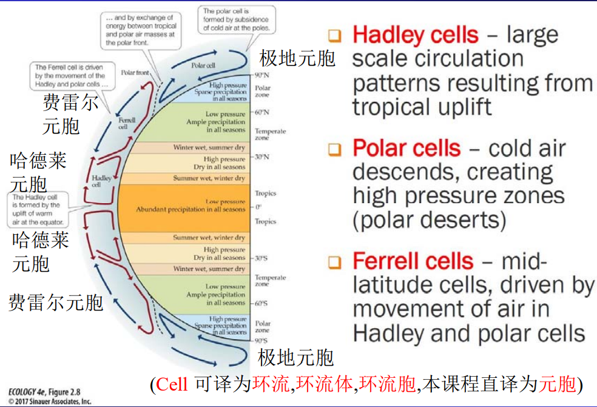

#C1
三种系统：
- 封闭系统；与外部环境只有能量的交换
- 开放系统：与外界环境既交换能量，又交换物质
- 孤立系统：与外界没有任何能量和物质交换

三种“稳定”状态：
- 孤立系统的==平衡态==：没有外界影像的情况下，系统内各部分长时间不发生任何变化的状态
- 封闭系统的==定态==：指存在外界影响、但外界条件稳定不变的情况下，系统内各部分长时间不发生任何变化的状态
- 开放系统在非平衡状态下的==有序结构==：指在远远偏离平衡状态的情况下，借助于外界的能流和物质流而维持的一种空间或时间的有序结构，又称==耗散结构==

水文系统及其子系统：包括大气-海洋系统、坡面系统、冰川系统、滨岸系统、风成沉积系统、河流系统

1. 大气-海洋系统：
2. 坡面系统：坡面系统的主要动力过程：滑坡、山体崩塌、坡面流水力侵蚀（三者为流域泥沙的主要来源）   修建梯田是防治滑坡、保护坡面的有效措施
3. 冰川系统
4. 滨岸系统：为了减轻海岸侵蚀，需要用防波堤阻断沿岸输移过程
5. 风成沉积系统：
6. 河流系统

河流最后的弯曲程度，要让单位河长上的水流功率恰好足够输运来沙（一会儿冲刷一会儿淤积）
