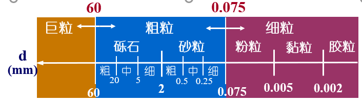
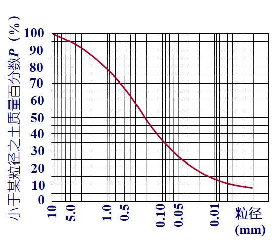
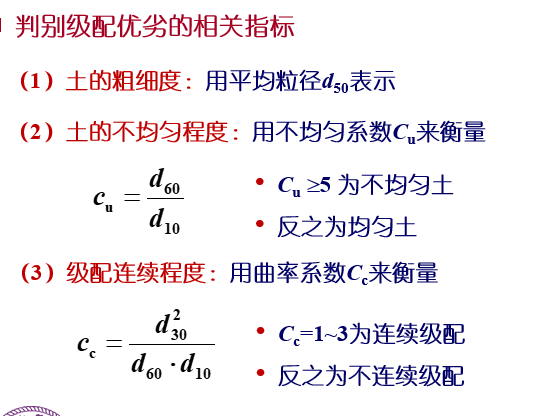

# C1:第一章 土的物理性质与工程分类

土的形成：风化、搬运、沉积（岩石-->土）

地质成岩作用（土-->岩石）

- 风化
  - 物理风化：矿物成分与母岩相同，称**原生矿物**，形成无黏性土
  - 化学风化：颗粒成分发生质的变化（与母岩不同），称为**次生矿物**，形成细微土颗粒（黏性颗粒及可溶盐类）
  - 生物分化：导致腐殖质的形成
- 搬运与沉积
  - 残积土（无搬运）：母岩表层经风化作用破碎成岩屑或细小颗粒后，未经搬运残留在原地的堆积物
    - 颗粒表面粗糙
    - 多棱角
    - 粗细不均
    - 无明显层理
  - 运积土（有搬运）：自然力搬运
    - 坡积土、洪基土、冲积土、湖泊沼泽积土、海相沉积物、冰积土、风积土等

土的三相组成：
- 固相：固体颗粒部分，构成土体骨架，对土的性质起决定作用
- 液相：土中水部分，存在于土体骨架的孔隙之中，对土的性质会发生重要影响
- 气相：土中气体部分，占据土体骨架孔隙的其余部分，对土的性质次要作用

- 饱和土：土体孔隙完全被水充满
- 非饱和土：孔隙中水和气均存在
- 干土：土体孔隙完全被气充满

固体颗粒：
1. 粒径级配：颗粒粒径的大小及在土中所占的质量百分比
2. 矿物成分：固体颗粒的矿物组成和成分
3. 颗粒形状：固体颗粒的形状

粒组：按粗细进行分组，将粒径接近的归成一类

粗粒土：以砾石和砂粒为主要组成的土，也称无黏性土；细粒土：以粉粒、黏粒和胶粒为主要组成的土，也称黏性土

- 平均粒径d50:土中大于此粒径和小于此粒径的土的含量均占50%
- 控制（限制）粒径d60:土中粗颗粒的代表粒径
- 有效粒径d10:土中细颗粒的代表粒径
- 连续粒径d30:衡量级配的连续性的粒径

Cu$\geq 5$且 Cc=1~3为级配良好的土；如果Cu<5 或Cc>3或Cc<1为级配不良的土

黏土矿物是一种复合的铝-硅盐晶体，颗粒呈片状，是由硅片和铝片构成的晶包所组叠而成。
- 高岭石：
  - 晶层间通过氢键联结，联结力强，晶格不能自由活动，水难以进入晶格间
  - 能组叠很多晶层，多达百个以上，成为一个颗粒。颗粒长宽约0.3-3$\mu m$，厚约0.03-1$\mu m$
  - 主要特征：颗粒较粗，不容易吸水膨胀和失水收缩，或者说亲水能力差
- 蒙特石：
  - 晶层间是O2-对O2-的连结，联结力很弱，水很容易进入晶层之间
  - 每一颗粒能组叠的晶层数较少。颗粒大小约为0.1-1$\mu m$，厚约0.001-0.01$\mu m$
  - 主要特征：颗粒细微，具有显著的吸水膨胀、失水收缩的特性，或者说亲水能力强
- 伊利石：
  - 是云母在碱性介质中风化的产物
  - 与蒙特石相似，由两层硅片夹一层铝片所形成的三层结构，但晶层之间有钾离子连结
  - 主要特征：连结强度弱于高岭石而高于蒙特石，其特征也介于两者之间

黏土颗粒总体带负电荷

对于黏性土，比表面积大小直接反映土颗粒与四周介质,特别是水，相互作用的强烈程度，是代表黏性土特征的一个很重要的指标

