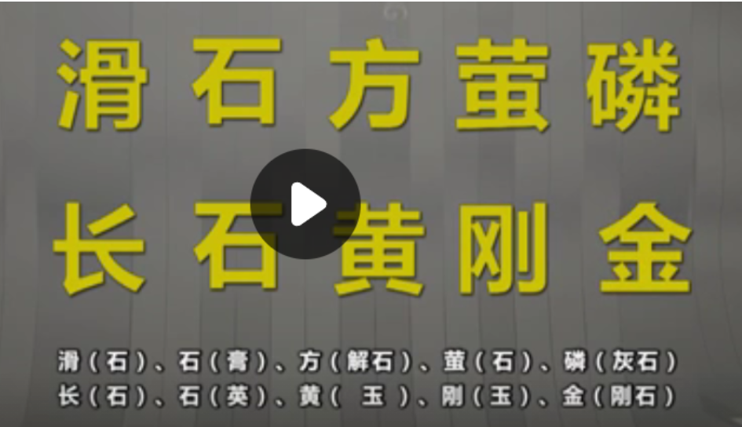

#第4章 矿物与岩石
## 4.1 矿物
###4.1.1 矿物及其形态特征
最主要的八种元素：氧硅铝铁钙钠钾镁  98%+

绝大多数以化合物形式存在

1. 岩石分类：
   1. 矿物：与化学成分的这样单质和化合物（3000多种）（占99%以上的不过十几种）
   2. 岩石：由一种和多种矿物和岩石碎屑组成的自然集合体
      1. 岩浆岩
      2. 沉积岩（在地表占3/4）（地表越往下比例越小）
      3. 变质岩
      4. 岩浆岩和变质岩可以通过母岩的风化、剥蚀、搬运、沉积以及硬结成岩的过程可以形成沉积岩
      5. 变质作用形成变质岩
      6. 岩浆作用形成岩浆岩
###4.1.2 矿物与岩石-矿物特征-矿物的物理力学性质
   1. 矿物：
      1. 结晶质矿物（内部排列规律，外形呈方形）
      2. 非晶质矿物
      3. 晶体的形态、集合体的形态
   2. 矿物以三维空间生长程度分类
      1. 一向延长型矿物：针柱状、纤维状、放射状
      2. 两向延长型矿物：片状、板状、鳞片状
      3. 三向延长型矿物：粒状、球状
   3. 集合体形态：晶簇、纤维状集合体、土状
   4. 矿物物理性质：
      1. 颜色（主要取决于化学成分和内部结晶构造），要选择矿物的新鲜断面
         1. 白色：方解石、白云石、斜长石、滑石、高岭石、石英
         2. 黑色：辉石、角闪石、黑云母
         3. 黄色：黄铁矿、自然金、自然硫
         4. 肉红色：正长石、石榴子石
         5. 绿色：蛇纹石、橄榄石、绿泥石
         6. 蓝色：蓝铜矿
         7. 紫色：石英（紫水晶）
      2. 条痕：矿物在无釉陶瓷板上进行刻划留下的颜色
      3. 光泽：在可见光的照射下对可见光的反射能力（黄铁矿：金属光泽，方解石和长石：玻璃光泽，石英断口：油脂状光泽，滑石：蜡状光泽，石棉：丝绢光泽，云母：珍珠光泽，金刚石：金刚光泽）
      4. 透明度：物体透过可见光的能力（透明、半透明、不透明）
   5. 矿物的力学性质：
      1. 硬度：矿物抵抗刻划和摩擦的能力（莫氏硬度：10级，指甲硬度为2.5）
       
      2. 解理：矿物受到敲击后裂开形成的光滑截面
      3. 断口：矿物受敲击后沿着任意方向裂开，形成凹凸不平的断面（石英敲击形成贝壳状断口）

### 4.1.3 常见矿物肉眼鉴定
- 滑石($Mg_3[Si_4O_{10}](OH)_2$)：白色，常因含有杂质而呈灰色、淡黄、淡绿色；条痕为白色,集合体呈致密的块状，单体呈薄片状，具有一组明显的节理，呈现蜡状光泽，硬度为1（可以用指甲轻松刻划），用于造纸、燃料、印刷等。
- 高岭石($AL_4[Si_4O_{11}](OH)_6$)：白色，因含杂质可呈浅黄、浅褐色，集合体呈土状，土状光泽/没有光泽，干燥时高岭石非常容易吸水，吸水后具有可塑性，不具有吸水膨胀性，硬度为1-1.5，具有一组明显的解理，矿物颗粒呈粉末状，陶瓷工业主要原料。
- 绿泥石：浅绿至深绿色，片状，硬度2-2.5，指甲能够刻划，但难度较大。晶体呈片状，集合体呈鳞片状，具有一组完全的解理。解理面具有玻璃状和珍珠状光泽。
- 黑云母：薄片褐色透明、厚片黑色，片状，具有一组极为明显的解理，解理面具有珍珠或玻璃状光泽，硬度2.5-3（指甲划不动，钢刀可以刻划），具有良好的弹性
- 白云母：薄片无色透明、厚片银白色，片状，具有高度的绝缘性、耐热性、抗酸抗碱性，必备绝缘材料
- 方解石($CaCO_3$)：白色、无色透明,具有玻璃光泽，集合体呈棱形六面体或不规则粒状，指甲划不动，钢刀可以刻划，硬度为3 ，具有三组完全的解理，滴稀盐酸后会发生剧烈反应
- 白云石($CaMg[CO_3]_2$)：灰白、淡粉红色，集合体呈菱面体、不规则粒状，晶面弯曲呈鞍状，硬度3.5-4，具有三组完全的解理，滴稀盐酸后无反应，但粉末可以与稀盐酸反应起泡
- 角闪石：黑、黑绿色，针柱状，具有两组中等的解理，解理面呈现玻璃光泽，硬度5-6，钢刀无法刻划
- 辉石：黑色，短柱状、粒状，两组中等解理，解理面玻璃光泽，硬度5-6
- 正长石：多为肉红色，外形呈短柱状、板条状、不规则粒状，两组解理，其中一组为完全解理，另外一组为中等解理，玻璃光泽，硬度6
- 斜长石：白色、灰白色，板条状、不规则粒状，具有两组解理，一组完全解理，一组中等解理，两组解理面夹角为86°28分，玻璃光泽，硬度6
- 石英($SiO_2$)：纯净石英为无色透明（水晶），含有杂质而呈现灰白色、烟灰色或紫色，六方形柱体，一般为粒状，晶面玻璃光泽，没有解理，断口呈现贝壳状，具有油脂状光泽，硬度7

## 4.2 岩浆岩
### 4.2.1 岩浆岩的主要成分
岩浆岩的主要矿物成分：二氧化硅$SiO_2$
岩石中二氧化硅含量超过65%时，成分中金属元素钾、纳含量偏高，而铁、镁、钙含量偏少，相应岩石中石英、长石等浅色矿物多，角闪石、辉石、橄榄石等暗色矿物少。
    根据二氧化硅的含量将岩浆岩分为酸性岩（>65%,主要矿物成分为石英和正长石）、中性岩（52%-65%，矿物成分是斜长石、正长石和角闪石）、基性岩（45%-52%，斜长石和辉石）、超基性岩四部分（<45%，辉石和橄榄石）
主要矿物：正长石、斜长石、石英、云母、黑云母、辉石、角闪石、橄榄石这八种为**岩浆岩的主要造岩矿物**
- 浅色矿物：富含硅、铝，正长石、斜长石、石英、白云母
- 暗色矿物：富含铁、镁，黑云母、辉石、角闪石、橄榄石

### 4.2.2 岩浆岩的结构和构造
岩浆岩内部结晶程度较好，边缘结晶程度较差，形成隐晶质等。
岩浆岩的**结构**：岩石中矿物的==结晶程度、晶粒大小、晶体形态及它们彼此间的相互组合关系。==
根据岩浆岩的结构特征可以将其划分为：
- 显晶质结构：全部由结晶矿物组成（深成侵入岩体的典型的结构特征）（花岗岩，正长石+石英）
- 隐经质结构：构成岩石的矿物颗粒很细（浅成侵入岩和喷出岩的结构特征）（比较致密，抗风化能力强，如辉绿岩+玄武岩）
- 玻璃质结构：岩浆喷出地表后迅速冷凝（喷出岩特有特征）（黑曜岩，抗风化能力极强）
- 斑状结构：介于显晶质和隐晶质之间，岩石中较大的矿物颗粒被较小的颗粒包围（浅成岩和喷出岩），较大晶粒成为斑晶，较小颗粒为基质，内部结构不均匀，抗风化能力较差

构造不涉及颗粒大小，只关系到它们间的排列和分布特征
- 块状构造：内部分布均匀，无定向排列（深成岩中）（==花岗岩、花岗斑岩、灰绿岩==）
- 流纹构造：岩石中不同颜色条纹\拉长的气孔按照一定方向排列，反映了岩浆喷出地表后流动的痕迹，（流纹岩）
- 气孔构造：岩浆喷出地表后，由于压力急剧降低，岩浆内部挥发性组分呈现气体状析出，并聚集形成气泡（喷出岩），密度较低
- 杏仁构造：气孔被次生性矿物（方解石等）填充（==玄武岩==）

### 4.2.3 岩浆岩的分类和鉴定
差异性：矿物==成分、结构、构造、产状及成因==等
岩浆岩分类基本依据：化学成分、矿物组成、结构、构造、形成条件及产状
分类描述方法：产状和成分
    深成岩通常是粗颗粒的显晶质结构，浅成岩和喷出岩通常是隐晶质或者斑状结构（==结晶程度越来越差==）

决定颜色：暗色矿物含量（暗色矿物多为基性/超基性岩）
### 4.2.4 常见岩浆岩特征1
花岗岩：酸性深成侵入岩体
主要矿物成分：石英、正长石
有一组具有玻璃光泽的解理面，有时会含有少量黑云母和角闪石
原生节理：会在水平、垂直、倾斜三个方向上存在一些裂隙。对采石场来说有利，但加快了岩浆岩的风化速度，有明显的球形风化过程。

花岗斑岩（酸性浅成岩）（斑状结构和块状构造），斑晶为正长石，晶质为隐晶质。

流纹岩（酸性喷出岩），斑状结构，流纹状构造，基质为隐晶质，优点：质地坚硬、强度较高，可作为良好的建筑材料； 缺点：作为地基时应注意下伏岩层及接触带的性质。

正长岩（中性深成岩），显晶质结构，块状构造，主要矿物为正长石，具有一组明显的玻璃光泽的解理面，不含石英（可以与花岗岩区分）

正长斑岩（中性浅成侵入岩），斑状结构，块状构造，斑晶为正长石，基质隐晶质

粗面岩（中性喷出岩），淡红/浅黄色，斑状结构，块状构造，斑晶为正长石，基质隐晶质
### 4.2.5 常见岩浆岩特征2
闪长岩（中性深成岩），灰色/深灰色，显晶质结构，块状构造，矿物：斜长石（白色/灰白色）+角闪石（针柱状），抗压强度较高

闪长玢岩（中性浅成岩），斑状结构，块状构造，斑晶：白色斜长石+少量黑色柱状角闪石，基质为隐晶质

安山岩（中性喷出岩），斑状结构，块状构造，斑晶：白色板条状斜长石，基质为隐晶质，不含角闪石（与闪长玢岩区分）

辉长岩（基性深成侵入岩），显晶质结构，块状构造，主要矿物成分：黑色粒状辉石和灰白色斜长石，强度较高，抗风化能力强

辉绿岩（基性浅成侵入岩），多呈暗绿色，隐晶质结构，块状构造，主要矿物成分：辉石和斜长石（颗粒小，无法肉眼识别）

玄武岩（基性喷出岩），地球上分布最为广泛的火山岩，黑色或褐色，主要矿物成分为隐晶质的辉石和斜长石
在冷凝过程中通常会发育一系列的柱状原生节理，形成六边形柱体，使岩石强度降低。
## 4.3 沉积岩
沉积岩的成岩阶段：风化剥蚀-搬运-沉积-硬结成岩
沉积岩的矿物成因：
- 碎屑矿物：原岩的一些原生矿物碎屑（石英、长石、白云母等）
- 粘土矿物：原岩经风化分解形成的此生矿物（高岭石、蒙脱石、水云母等）
- 化学沉积矿物：经化学沉积或生物化学沉积作用形成的（方解石、白云石、石膏、石盐、铁锰氧化物或氢氧化物）
- 有机质及生物残骸：生物残骸或经有机化学变化而成的矿物（贝壳、硅藻土、泥炭、石油等）

胶结物：
- 硅质胶结：胶结成分为$SiO_2$，岩石呈灰、灰白、黄色等，通常强度较高，抗水抗风化能力较强
- 铁质胶结：胶结成分为$Fe_2O_3或FeO$,二氧化三铁时呈红棕色，强度较高；氧化亚铁时呈黄褐色，岩石软弱，易于风化。

