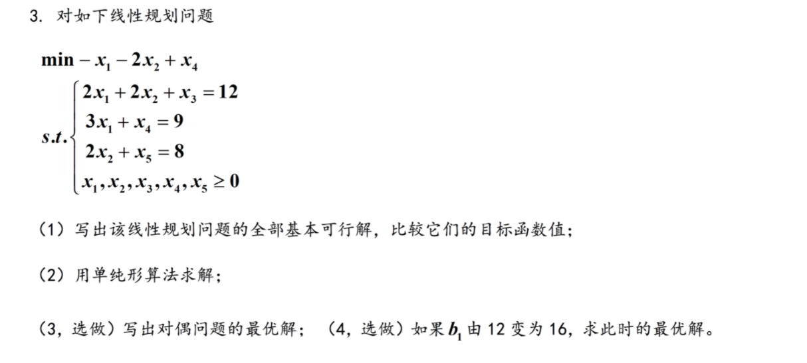

解：（1）求基本解
选定基$B_1=\begin{pmatrix}2&1\\3&1\end{pmatrix}$,则基本解$x_1=\begin{pmatrix}B_1^{-1}*b\\0\end{pmatrix}=\begin{pmatrix}3\\-2\\0\end{pmatrix}$；
选定基$B_2=\begin{pmatrix}2&2\\3&1\end{pmatrix}$,则基本解$x_2=\begin{pmatrix}B_2^{-1}*b\\0\end{pmatrix}=\begin{pmatrix}0.5\\0\\1.5\end{pmatrix}$；
选定基$B_3=\begin{pmatrix}1&2\\3&1\end{pmatrix}$,则基本解$x_3=\begin{pmatrix}B_3^{-1}*b\\0\end{pmatrix}=\begin{pmatrix}0\\0.4\\1.8\end{pmatrix}$。
在可行域$\{x|Ax=b,x\geq 0\}$上，基本可行解只剩下$x_2=\begin{pmatrix}0.5\\0\\1.5\end{pmatrix}$和$x_3=\begin{pmatrix}0\\0.4\\1.8\end{pmatrix}$。
在可行域上考虑线性函数$z=4x_1+x_2+x_3$，分别将基本可行解$x_2和x_3$带入得，$z_2=3.5$，$z_3=2.2$。
故该线性函数的最大值为3.5，相应最大点为$x=\begin{pmatrix}0.5\\0\\1.5\end{pmatrix}$，最小值为2.2，相应最小点为$x=\begin{pmatrix}0\\0.4\\1.8\end{pmatrix}$。

证明：对于任意问题（1）的可行解$x$和问题（2）的可行解$w$，满足：
$$
\begin{aligned}c^Tx&=c^TA^{-1}Ax=c^TA^{-1}b
\\b^Tw&=b^T(A^T)^{-1}A^Tw\leq b^T(A^T)^{-1}c
\\&=(b^T(A^T)^{-1}c)^T=c^TA^{-1}b\end{aligned}\\故，b^Tw\leq c^Tx$$

解：
（1）$$A=\begin{pmatrix}2&2&1&0&0\\3&0&0&1&0\\0&2&0&0&1\end{pmatrix}$$
选定基$B_1=\begin{pmatrix}2&2&1\\3&0&0\\0&2&0\end{pmatrix}$,则基本解$x_1=\begin{pmatrix}B_1^{-1}*b\\0\end{pmatrix}=\begin{pmatrix}3\\4\\-2\\0\\0\end{pmatrix}$；
选定基$B_2=\begin{pmatrix}2&2&0\\3&0&1\\0&2&0\end{pmatrix}$,则基本解$x_2=\begin{pmatrix}B_2^{-1}*b\\0\end{pmatrix}=\begin{pmatrix}2\\4\\0\\3\\0\end{pmatrix}$；
选定基$B_3=\begin{pmatrix}2&2&0\\3&0&0\\0&2&1\end{pmatrix}$,则基本解$x_3=\begin{pmatrix}B_3^{-1}*b\\0\end{pmatrix}=\begin{pmatrix}3\\3\\0\\0\\2\end{pmatrix}$；
选定基$B_4=\begin{pmatrix}2&1&0\\3&0&1\\0&0&0\end{pmatrix}$,$B_4$列向量间两两不独立，因此并不能算作一组基;
选定基$B_5=\begin{pmatrix}2&1&0\\3&0&0\\0&0&1\end{pmatrix}$,则基本解$x_5=\begin{pmatrix}B_5^{-1}*b\\0\end{pmatrix}=\begin{pmatrix}3\\0\\6\\0\\8\end{pmatrix}$；
选定基$B_6=\begin{pmatrix}2&0&0\\3&1&0\\0&0&1\end{pmatrix}$,则基本解$x_6=\begin{pmatrix}B_6^{-1}*b\\0\end{pmatrix}=\begin{pmatrix}6\\0\\0\\-9\\8\end{pmatrix}$；
选定基$B_7=\begin{pmatrix}2&1&0\\0&0&1\\2&0&0\end{pmatrix}$,则基本解$x_7=\begin{pmatrix}B_7^{-1}*b\\0\end{pmatrix}=\begin{pmatrix}0\\4\\4\\0\\9\end{pmatrix}$；
选定基$B_8=\begin{pmatrix}2&1&0\\0&0&0\\2&0&1\end{pmatrix}$,$B_8$列向量间两两不独立，因此并不能算作一组基;
选定基$B_9=\begin{pmatrix}2&0&0\\0&1&0\\2&0&1\end{pmatrix}$,则基本解$x_9=\begin{pmatrix}B_9^{-1}*b\\0\end{pmatrix}=\begin{pmatrix}0\\6\\0\\9\\-4\end{pmatrix}$；
选定基$B_{10}=\begin{pmatrix}1&0&0\\0&1&0\\0&0&1\end{pmatrix}$,则基本解$x_{10}=\begin{pmatrix}B_{10}^{-1}*b\\0\end{pmatrix}=\begin{pmatrix}0\\0\\12\\9\\8\end{pmatrix}$；
故基本可行解包括：
$x_2=\begin{pmatrix}2\\4\\0\\3\\0\end{pmatrix}$，$x_3=\begin{pmatrix}3\\3\\0\\0\\2\end{pmatrix}$，$x_5=\begin{pmatrix}3\\0\\6\\0\\8\end{pmatrix}$，
$x_7=\begin{pmatrix}0\\4\\4\\0\\9\end{pmatrix}$，
$x_{10}=\begin{pmatrix}0\\0\\12\\9\\8\end{pmatrix}$。
对应的目标函数值分别为$z_2=-7,z_3=-9,z_5=-3,z_7=-8,z_{10}=9$。
（2）使用单纯形算法
利用`linprog`函数，所求得最小值为-9，对应解为：$x=\begin{pmatrix}3\\3\\0\\0\\2\end{pmatrix}$。
与利用基本可行解求得结果相同。
