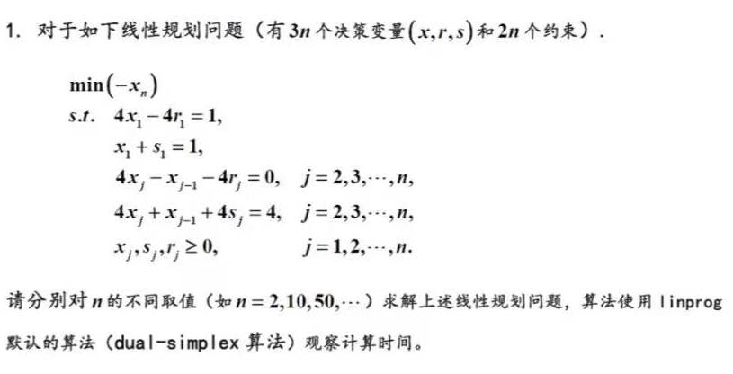
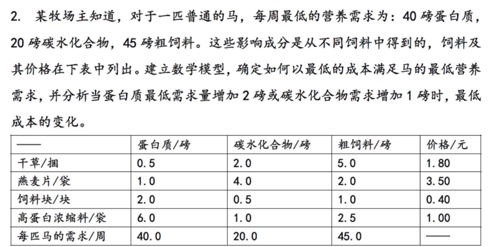
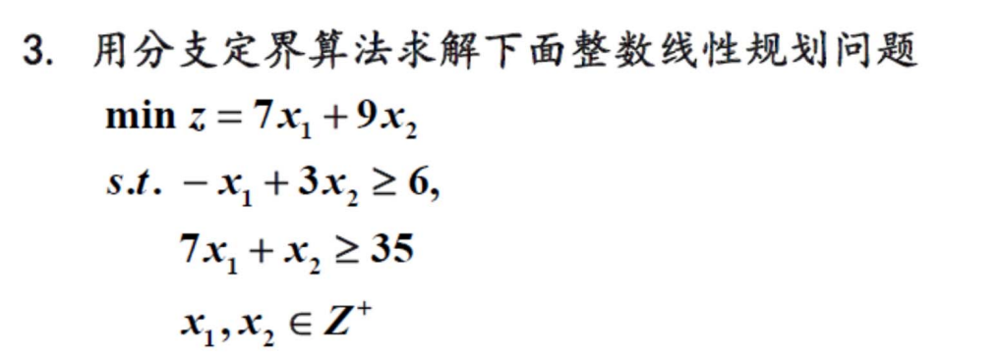
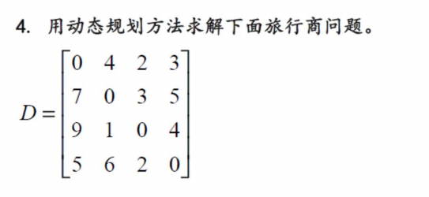

## 数学实验第七次作业
### 徐辉 土木96 2019010308
1、
首先取n=2，解得：
$$x_1=0.2500\quad x_2=0.9375\quad r_1=0\\r_2=0.8750\quad s_1=0.7500 \quad s_2=0$$

对于$-x_2$，最小值为：-0.9375。
运行时间为：0.148s。
取n=10,
对于$-x_{10}$，最小值为：-1。
运行时间为：0.189s。
取n=50,
对于$-x_{50}$，最小值为：-1。
运行时间为：0.231s。
取n=100,
对于$-x_{100}$，最小值为：-1。
运行时间为：0.296s。

2、
解：设牧场主每天提供给马的甘草、燕麦片、饲料块、高蛋白浓缩料数量分别为$x_1,x_2,x_3,x_4$，设一天的总成本为z元，则根据题目条件可得下列约束条件：
$$0.5x_1+x_2+2x_3+6x_4\geq 40,\\2x_1+4x_2+0.5x_3+x_4\geq 20,\\5x_1+2x_2+x_3+2.5x_4\geq 45,\\x_1,x_2,x_3,x_4\geq 0$$
需要最小化的目标函数为：
$$z=1.8x_1+3.5x_2+0.4x_3+x_4$$
将大于等于号转换为小于等于号，于是：
$$A=-\begin{bmatrix}0.5&1&2&6\\2&4&0.5&1\\5&2&1&2.5\end{bmatrix}\\b=-\begin{bmatrix}40&20&45\end{bmatrix}$$
利用matlab`linprog`函数解得：
$$x=\begin{bmatrix}5\\0\\20\\0\end{bmatrix}\\z_{min}=17$$
故当每天供应5捆干草，20块饲料块的时候，可以以最低成本满足营养需求，最低成本为每天17元。
在matlab中输入`lag.ineqlin.lag.lower`，得到结果如下：.png)
故当蛋白质最低需求量增加2磅时，最低成本不发生变化，当碳水化合物需求增加1磅时，最低成本增加0.4元。

3、

解：首先去掉整数约束，变成一般线性规划问题：
$$min\;z=7x_1+9x_2\\s.t.\left\{\begin{array}{l}-x_1+3x_2\geq 6,\\ 7x_1+x_2\geq 35\\x_1,x_2\geq 0\end{array}\right.$$
记为(LP)。
求（LP）的最优解：
$$x_1=4.5\quad x_2=3.5\quad z^{(0)}=63$$
对于$x_1$，取值$x_1\leq 4,x_1\geq 5$，对于$x_2$取值$x_2\leq 3,x_2\geq 4$先将(LP)划分为(LP1)和(LP2)，取$x_1\leq 4,x_1\geq 5$，拆分的两个问题分别为：
$$min\;z=7x_1+9x_2\\(LP1)s.t.\left\{\begin{array}{l}-x_1+3x_2\geq 6,\\ 7x_1+x_2\geq 35\\x_1\leq 4\\x_1,x_2\in Z^+\end{array}\right.\\min\;z=7x_1+9x_2\\(LP2)s.t.\left\{\begin{array}{l}-x_1+3x_2\geq 6,\\ 7x_1+x_2\geq 35\\x_1\geq 5\\x_1,x_2\in Z^+\end{array}\right.$$
先求(LP1),解得
$$x_1=4\quad x_2=7\quad z^{(1)}=91$$
找到整数解，问题已探明，此枝停止计算。同理解(LP2)，最优解为：
$$x_1=5\quad x_2=3.667\quad z^{(2)}=68$$
因为$z^{(2)}\lt z^{(1)}$，所以原问题有比91更小的最优解。利用$3\leq 3.6667\leq 4$加入条件。有如下拆分：
$$min\;z=7x_1+9x_2\\(LP3)s.t.\left\{\begin{array}{l}-x_1+3x_2\geq 6,\\ 7x_1+x_2\geq 35\\x_1\geq 5\\x_2\leq 3\\x_1,x_2\in Z^+\end{array}\right.\\min\;z=7x_1+9x_2\\(LP4)s.t.\left\{\begin{array}{l}-x_1+3x_2\geq 6,\\ 7x_1+x_2\geq 35\\x_1\geq 5\\x_2\geq 4\\x_1,x_2\in Z^+\end{array}\right.$$
先求(LP3)，无可行解，再求解(LP4)，解得：
$$x_1=5\quad x_2=4\quad z^{(2)}=71$$
至此，原问题的最优解为:
$$x_1=5\quad x_2=4$$
最优值为：
$$z_{min}=71$$
4、
解：
$$f_3(v_0,\{v_1,v_2,v_3\})=min\left\{\begin{array}{l}d_{01}+f_2(v1,\{v_2,v_3\})\\d_{02}+f_2(v_2,\{v_1,v_3\})\\d_{03}+f_2(v_3,\{v_1,v_2\}) \end{array} \right\}\\f_2(v_1,\{v_2,v_3\})=min\{d_{12}+f_1(v_2,\{v_3\}),d_{13}+f_1(v_3,\{v_2\})\}\\f_2(v_2,\{v_1,v_3\})=min\{d_{21}+f_1(v_1,\{v_3\}),d_{23}+f_1(v_3,\{v_1\})\}\\f_2(v_3,\{v_1,v_2\})=min\{d_{31}+f_1(v_1,\{v_2\}),d_{32}+f_1(v_2,\{v_1\})\}\\f_1(v_1,\{v_2\})=d_{12}+d_{20}=12,\\f_1(v_1,\{v_3\})=d_{13}+d_{30}=10,\\f_1(v_2,\{v_1\})=d_{21}+d_{10}=8,\\f_1(v_2,\{v_3\})=d_{23}+d_{30}=9,\\f_1(v_3,\{v_1\})=d_{31}+d_{10}=13,\\f_1(v_3,\{v_2\})=d_{32}+d_{20}=11\\f_2(v_1,\{v_2,v_3\})=min\{3+9,5+11\}=12\\f_2(v_2,\{v_1,v_3\})=min\{1+10,4+12\}=11\\f_2(v_3,\{v_1,v_2\})=min\{6+12,2+8\}=10\\ \\ f_3(v_0,\{v_1,v_2,v_3\})=min\{4+12,2+11,3+10\}=13$$
故，最小距离为13，路线为0-2-1-3-0或0-3-2-1-0。

