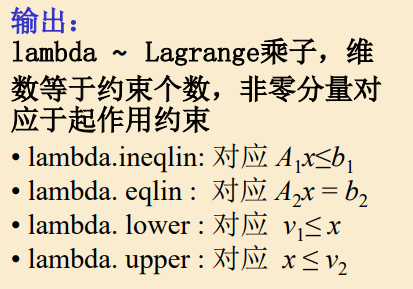

#第七讲 优化方法Ⅰ 线性规划
#linear programming
优化问题的三要素：
- 决策变量
- 目标函数
- 约束条件
优化约束可分为**线性规划LP**和**非线性规划NLP**
##二维线性规划的图解法
||2维|n维|
|---|---|---|
|可行域|线段组成的凸多边形|超平面组成的凸多面体|
|目标函数|等值线为直线|等值线是超平面|
|最优解|凸多边形的某个顶点|凸多面体的某个顶点|

**基本可行解**：设B是秩为m的约束矩阵A的一个m阶满秩子方阵，则称B为一个<font color='red'>基</font>；B中m个线性无关的列向量称为<font color='red'>基向量</font>，变量x中与之对应的m个分量称为<font color='red'>基变量</font>，其余的变量为<font color='red'>非基变量</font>，令所有的非基变量取值为0，得到的解$x=\begin{pmatrix}B^{-1}b\\0\end{pmatrix}$称为相应于B的<font color='red'>基本解</font>，当$B^{-1}b\geq 0$则称基本解为<font color='red'>基本可行解</font>，这时对应的基阵B为<font color='red'>可行基</font>。
如果$B^{-1}b>0$，则称该<font color='red'>基本可行解</font>为<font color='red'>非退化的</font>，如果一个线性规划的所有基本可行解都是非退化的，则称该规划为<font color='red'>非退化的</font>。

LP基本性质：
- 可行域存在时，必是凸多面体；
- 最优解存在时，必在可行域的顶点取得；
- 基本可行解对应于可行域的顶点。
基本解数量不超过$\begin{pmatrix}n\\m\end{pmatrix}=\frac{n!}{m!(n-m)!}$
**最优解只需在有限个可行解（基本可行解）中寻找**
##单纯形法（G.B.Dantzig,1947)
基本思路：用迭代法从一个顶点（基可行解）转换到另一个顶点（称为一次旋转），每一步转换只将一个非基变量（指一个分量）变为基变量，称为<font color='red'>进基</font>,同时将一个基变量变为非基变量，称为<font color='red'>出基</font>，进基和出基的确定需要使目标函数下降（至少不增加）

原理：


单纯形法的计算步骤：
- 将线性规划问题化成标准型。
- 找出或构造一个m阶单位矩阵作为初始可行基，建立初始单纯形表。
- 计算各非基变量$x_j$的检验数$\sigma_j=C_j-C_BP_j^{'}$，若所有$\sigma_j\leq 0$，则问题已得到最优解，停止计算，否则转入下步。
- 在大于0的检验数中，若某个$\sigma_k$所对应的系数列向量$P_k\leq 0$，则此问题是无界解，停止计算，否则转入下步。
- 根据$max\{\sigma_j|\sigma_j>0\}=\sigma_k$原则，确定$x_k$为换入变量（进基变量），再按$\theta$规则计算：$\theta=min\{b_i/a_{ik}|a_{ik}>0\}=b_l/a_{ik}$,确定$x_{Bl}$为换出变量。建立新的单纯形表，此时基变量中$x_k$取代了$x_{Bl}$的位置。
- 以$a_{ik}$为主元素进行迭代，把$x_k$所对应的列向量变为单位列向量，即$a_{ik}$变为1，同列中其他元素为0，转第3步。

注：课堂的标准型为求min z，其余均相似。

##对偶问题
原问题P：
$$ min\;z=c^Tx\\s.t.\;Ax=b,x\geq0$$对偶问题D：
$$max\;b^Ty\\s.t.\;A^Ty\leq c$$
**定理**：原问题和对偶问题互为对偶问题，即对偶问题的对偶问题就是原问题
**对偶定理**：如果x是原问题的可行解，y是对偶问题的可行解，则$b^Ty\leq c^Tx$
- 若x和y还满足$b^Ty=c^Tx$，则分别是P和D的最优解
- 若原问题P无下界，则对偶问题D不可行
- 若对偶问题D无上界，则原问题P不可行

实例：影子价格
定义：最优配置下资源的理想价格
含义：$B^{-1}b>0$，对充分小的需求增量$\Delta b$，$B^{-1}(b+\Delta b)>0$仍为最优解，此时相应的最优费用变为$C_B^T\Delta b$，对偶变量$y^*=(C_B^TB^{-1})^T$被称为边际价格或影子价格，$y_i^*$可以看成最优解时，为了第i种需求提供一个单位需求的边际费用，即当达到最优时，为了满足附加的需求，必须向顾客索取的最小单位价格。

MATLAB求解LP：
$$min \;z=c^Tx\\s.t.\quad A_1x\leq b_1,A_2x=b_2,v_1\leq x\leq v_2$$
```MATLAB
[x,fval,exitflag,output,lambda]=linprog(c,A1,b1,A2,b2,v1,v2,x0,opt)
```



