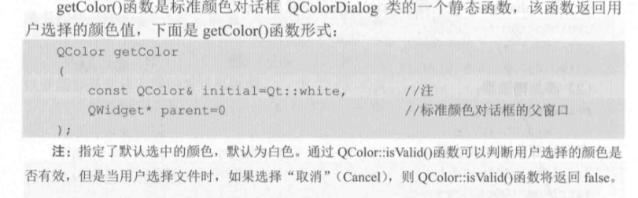

# 第1章 Qt概述

- tips1：在每一个Qr应用程序中必须使用一个QApplication对象，且必须在任何窗口系统部件使用之前被创建。
- 定义快捷键：在显示文本的某个字符前面加前缀"&"（只有QLable才有）
- 伙伴编辑模式：当用户激活标签的快捷键时，鼠标/键盘的焦点会转移到它的伙伴窗口部件上。
- 信号和槽：信号会在某个特定情况或动作下被触发，槽是等同于接收并处理信号的函数
- `SIGNAL()`与`SLOT()`是Qt定义的两个宏，它们返回其参数的C语言风格的字符串（const char*）
- Qt5元对象系统：
  - 基类QObjects：任何使用元对象系统功能的类必须继承自QObject
  - Q_OBJECT宏：必须出现在类的**私有声明区**
  - 元对象编译器

# 第2章 Qt5模板库、工具类及控件

## 2.1 字符串类

- `QString::append()`与`+=`等效，另外一个函数为`QString::sprintf()`，与C++库函数`sprintf()`定义相同。
- 
- 
- 
- 查询
  - `startsWith()`
  - `endsWith()`
  - `contains()`
  - `compare`
- 转换
  - `toInt(&ok,10)`：转换为10进制数，ok为转换状态
  - `toAscii()`
  - `tiLatin`()`
  - tips: `qDebug()<<`可输出Qt对象

## 2.2 容器类

tips：Qt的QObject及其他的子类是不能够储存在容器中的，因为其没有复制构造函数和赋值操作运算符，可替代的方案是存储QObject及其子类的指针。

### 2.2.1 QList,QLinkedList,QVector

- QList:（维护了指针数组）
  - 继承自QList的子类有`QItemSelection`,`QQueue`,`QSignalSpy`,`QStringList`,`QTestEventList`.
  - 插入操作：`append()`,`prepend()`,`insert()`.
  - 存储方式：运算符"<<"
- QLinkedList: 链式列表，非连续内存块保存数据
- QVector：既可以使用下标访问数据项，也可以使用迭代器访问。
- Java风格迭代器遍历容器：
  - 
  - 迭代点位于列表项中间，而不是直接指向某个列表项
  - tips：用Qt编写应用程序时，如果是控制台应用程序，建议初始化一个QCoreApplication对象，如果是GUI图形用户界面程序，初始化一个QApplication对象。
  - 迭代器next()函数会跳过下一个列表项并返回它跳过的列表项的内容
  - 
  - QMutableListIterator<T>提供了基本的遍历操作外，还提供了`insert()`,`remove()`和修改数据函数等
- STL风格迭代器遍历容器：
  - 
  - 直接指向列表项，“++”操作移动迭代器到下一个项，“*”操作运算符返回迭代器指向的项

### 2.2.2 QMap,QHash

- QMap<Key,T>提供了一个类型为Key的键到类型为T的值的映射
- QHash<Key,T>维护着一张哈希表，以任意的顺序组织它的数据
- Java风格迭代器遍历容器：
  - 不提供查找键的函数，但提供查找值的函数(`findNext()`)
- STL风格迭代器遍历容器：

## 2.3 QVariant类

类似于C++的`union`数据类型，可以保存多种Qt类型的值，也可以存放Qt的容器类型的值。

## 2.4 算法及正则表达式

### 2.4.1 Qt5常用算法

- qAbs()：绝对值
- qMax()：返回最大值
- qRound()：返回与一个浮点数最接近的整数值
- qSwap()：交换

### 2.4.2 基本的正则表达式

## 2.5 控件

- Buttons:
- Input Widgets：
  - QDateTime类：currentDateTime()可获得本地系统的时间和日期信息，date()和time()分别返回日期和时间部分
  - QTimer类（定时器）：
- Display Widgets：
- Spacers（空间间隔组）
- Layouts
- Containers:

Widget是使用Qt编写的图形用户界面应用程序的基本生成块，每种类型的组件都是由QWidget的特殊子类提供的，而QWidget自身又是QObject的子类。

通过传入QWidget构造函数的参数可以制定一个窗口部件的窗口标识(window flags)和父窗口。（`setWindowFlags()`与`setParent()`函数）

没有父窗口部件的 Widget对象是一个窗口，窗口通常具有一个窗口边框（frame）和一个标题栏。QMainWindow和所有的QDialog对话框子类都是经常使用的窗口类型,而子窗口部件通常处在父窗口部件的内部，没有窗口边框和标题栏。

构造函数：
&&
QWidget(QWidget *parent=0, Qt::WindowFlags f=0)
&&

如果Widget未使用父级进行创建，则在显示时视为窗口或顶层Widget.

==隐式共享==

又称==回写复制==，当两个对象共享同一份数据时（通过浅拷贝实现数据块的共享），如果数据不改变，则不进行数据的复制，而当某个对象需要改变数据时，则执行深拷贝。

QString内存分配策略：

Qt::WindowFlags枚举类型：

# 第3章 Qt5布局管理

## 3.1 分割窗口QSplitter

## 3.2 停靠窗口QDockWidget

## 3.4 基本布局

常用方法：`addWidget()`、`addLayout()`

# 第4章 Qt5基本对话框

## 4.2 标准颜色对话框类

## 4.3 标准字体对话框类

## 4.4 标准输入对话框类

>   QT通过信号与槽机制来实现通信的功能。当该类派生自QObject并且在头文件中添加Q_OBJECT宏以后，就可以使用信号与槽。

          信号与槽之间可以进行通信的根本原因是：当在类的头文件中添加Q_OBJECT以后QtCreator会自动的创建一个moc_***.cpp文件，用于实现信号与槽通信的代码。但是，有时当我们通过QtCreator创建类的时候，没有通过IDE选项选择其派生自QObject类，而是在后面添加的，则会出现QtCreator没有自动创建moc_***.cpp文件的情况。
    
         这种情况下就会报错 : undefined reference to `vtable for ***
    
         解决方法：
         
         从QtCreator去除该类的头文件，然后再通过“添加现有文件”的方法，将该头文件添加进来。这样QtCreator就会自动为该类创建moc_***.cpp文件。
    
         https://blog.csdn.net/qinpanke/article/details/8066397

## 4.5 消息对话框

`Question`,`Information`,`Warning`,`Critical`,`About`,`Custom`,`About Qt`.

## 4.7 工具盒类

## 4.8 进度条

`QProgressBar`与`QProgressDialog` 

## 4.9 调色板与电子钟

​        

