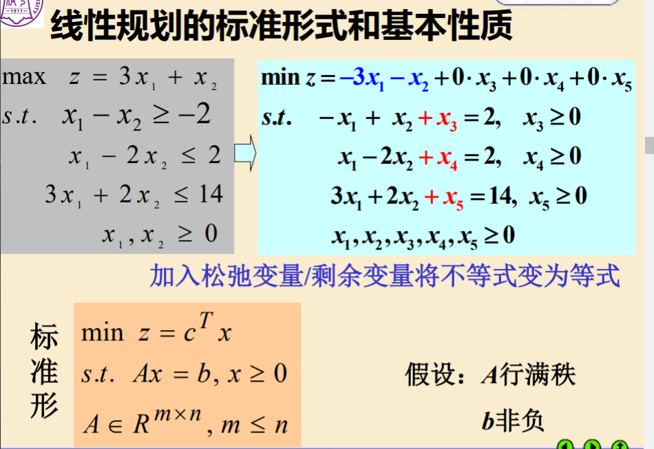

#第七讲 优化方法Ⅰ 线性规划
#linear programming
优化问题的三要素：
- 决策变量
- 目标函数
- 约束条件
优化约束可分为**线性规划LP**和**非线性规划NLP**
##二维线性规划的图解法
||2维|n维|
|---|---|---|
|可行域|线段组成的凸多边形|超平面组成的凸多面体|
|目标函数|等值线为直线|等值线是超平面|
|最优解|凸多边形的某个顶点|凸多面体的某个顶点|

**基本可行解**：设B是秩为m的约束矩阵A的一个m阶满秩子方阵，则称B为一个基；B中m个线性无关的列向量称为基向量，变量x中与之对应的m个分量称为基变量，其余的变量为非基变量，令所有的非基变量取值为0，得到的解$x=\begin{pmatrix}B^{-1}b\\0\end{pmatrix}$称为相应于B的基本解，当$B^{-1}b\geq 0$则称基本解为基本可行解，这时对应的基阵B为可行基。
如果$B^{-1}b>0$，则称该基本可行解为非退化的，如果一个线性规划的所有基本可行解都是非退化的，则称该规划为非退化的。

LP基本性质：
- 可行域存在时，必是凸多面体；
- 最优解存在时，必在可行域的顶点取得；
- 基本可行解对应于可行域的顶点。
基本解数量不超过$\begin{pmatrix}n\\m\end{pmatrix}=\frac{n!}{m!(n-m)!}$
**最优解只需在有限个可行解（基本可行解）中寻找**
##单纯形法（G.B.Dantzig,1947)
基本思路：用迭代法从一个顶点（基可行解）转换到另一个顶点（称为一次旋转），每一步转换只将一个非基变量（指一个分量）变为基变量，称为进基,同时将一个基变量变为非基变量，称为出基，进基和出基的确定需要使目标函数下降（至少不增加）

