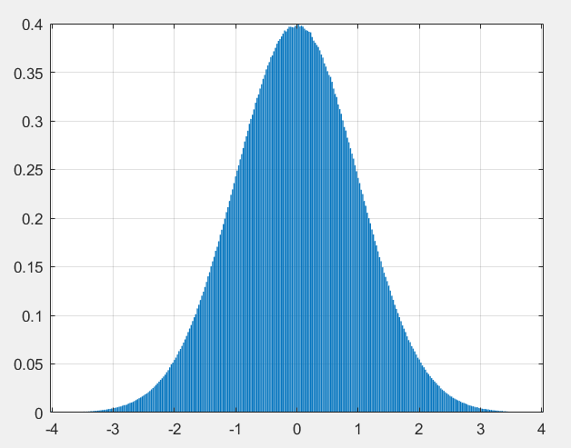

选定参数$\lambda$为5，生成一组长度为20的伪随机数为：`0.0834,0.6665,0.0327,0.0137,0.0775,0.0555,0.0594,0.1872,0.0845,0.3530,0.0696,0.6895,0.2568,0.6151,0.4663,0.0388,0.0728,0.2297,0.0102,0.6737`
利用$\chi^2$检验：
选定d=1000，则上述序列变为：
`84,666,32,13,77,55,59,187,84,353,69,689,256,615,466,38,72,229,10,673`
其中，84出现2次，其余数均出现1次。
$$
X=\sum_{i=1}^{1000}\frac{(N_i-20*1/1000)^2}{20*1/1000}\\=980*20/1000+19*\frac{(1-20*1/1000)^2}{20*1/1000}\\+\frac{(2-20*1/1000)^2}{20*1/1000}\\=1128
$$
X近似服从自由度为999为的$\chi^2$分布。
而$P(\chi^2(999)\geq 1128)=0.0027<0.1$
故，不可以接受这组数据来自参数为5的指数分布。

选定参数$\lambda$为1，生成一组长度为20的伪随机数为：`0.8238，0.9635，0.2672，0.2292，1.6673，0.7138，0.8084，0.4365，0.3434，0.2815，1.2873，0.2861，0.4230，1.8164，2.1287，0.6964，0.0411，1.0777，0.5357，1.4969`
利用$\chi^2$检验：
选定d=100，则上述序列变为：
`82，96，26，22，167，71，80，43，34，28，128，38，42，181，212，69，4，107，53，149`
均出现1次。
$$
X=\sum_{i=1}^{100}\frac{(N_i-20*1/100)^2}{20*1/100}\\=80*20/100+20*\frac{(1-20*1/100)^2}{20*1/100}\\=80
$$

X近似服从自由度为99为的$\chi^2$分布。
而$P(\chi^2(99)\geq 80)=0.9192>0.1$
故，可以接受这组数据来自参数为1的指数分布。

生成一组长度为4000的随机数组，画出齐归一化后的直方图：
(1)自带命令randn:

(2)12个[0,1]区间均匀随机数相加，标准化：

(3)6个[0,1]区间均匀随机数相加，标准化：

(4)线性同余生成器及Box-Muller变换：

