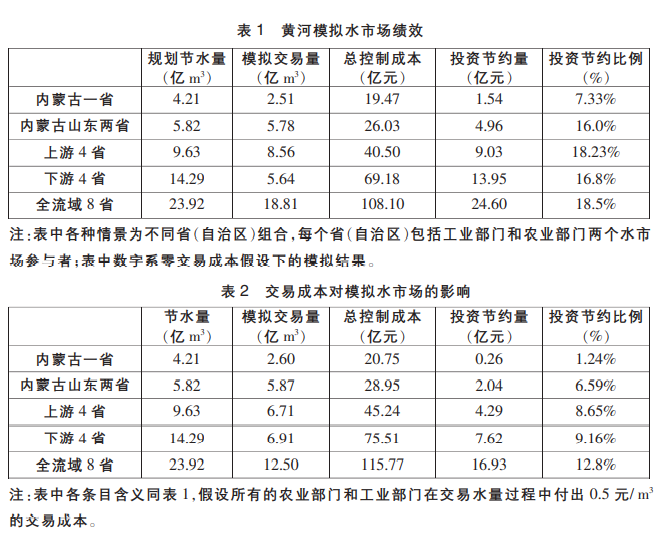
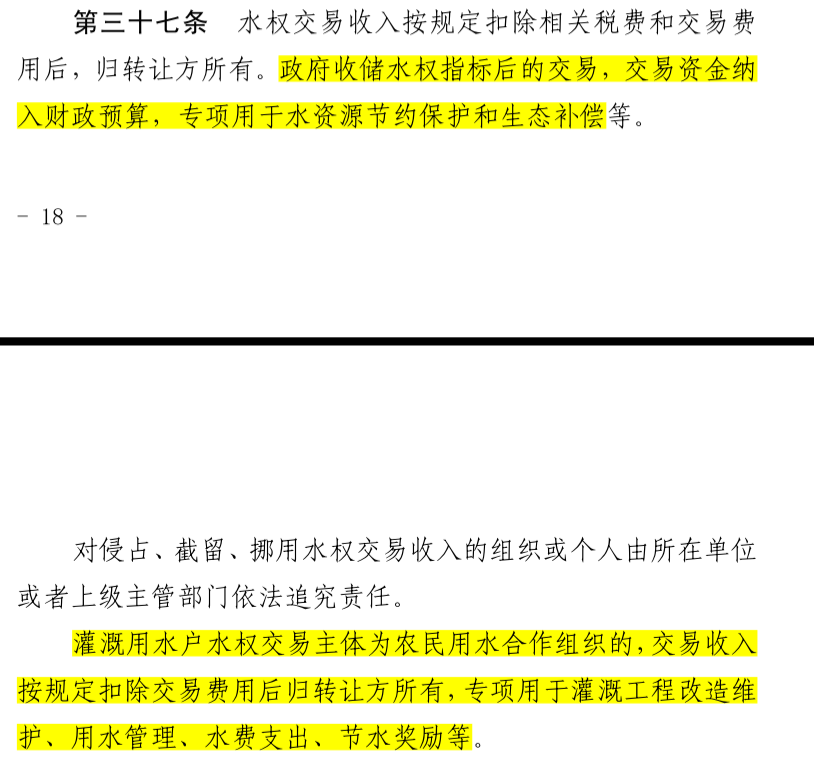
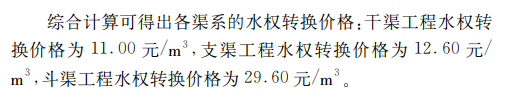
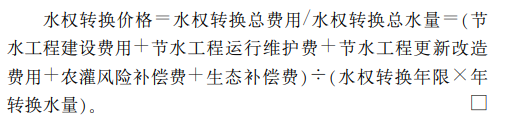

> 胡鞍钢，王亚华；转型期水资源配置的公共政策：准市场和政治民主协商
### 水资源配置的三种思路
- 指令配置模式：行政手段；问题：**“市场失灵”** **“政府失效”**
  - 以前的问题：各省水供给的约束条件主要是取水能力，开展“军备竞赛”
- 强有力的流域统一管理模式/建立水市场
- 准市场：“政治民主协商制度”“利益补偿机制”

黄河农业用水占全河用水量的92%，上游比例更高。
准市场：流域水资源在兼顾上下游防洪、发电、航运、生态等其它方面需要的基础之上，兼顾各地区的基本用水需求，部分多样化用水市场化，在上下游省份之间、地区之间和区域内部按市场化加以配置。
通过`政治协商`来实现部分多样化用水市场配置，约束机制主要是`合约约束`，且需建立一整套合约保障机制（水情监测、信息披露、用户广泛参与、初始产权公平划分）（==初始产权如何公平划分？==）
`黄河上中游水量调度委员会` `黄河防汛总指挥部`
可设立“水银行”，通过价格听证、市场干预等经济手段对水市场进行宏观调控。
将流域水资源划分为生态水、基本用水、多样化用水三部分，生态水不容采取和使用，基本用水由国家低费供给，部分多样化用水进入市场公开拍卖。（==谁为拍卖主体？如果为政府的话如何获悉适宜于当地居民水价的供需均衡点==）（==水权拍卖所得收益如何送到农户手中？又如何分配？平均分配还是按平日用水量分配？==）

> 胡鞍钢，王亚华；从东阳-义务水权交易看我国水分配体制改革

水资源的分配有三个层面上的含义，第一是用水权的初始分配，第二是用水权初始分配之后的再分配，第三是对水资源的工程利用后形成的水商品，如自来水、纯净水，在人群之间的分配。

对当前我国水资源分配体制总的评价是：用水权初始分配制度虽然引进，但不够完善；用水权的再分配由国家垄断，主要靠行政划拨；水上漂市场发展较快，但供水水价仍然过低。

> 王亚华，田富强；对黄河水权转换试点实践的评价和展望

`水权转换项目`
`1987年国务院颁布的黄河分水方案`
美国和澳大利亚有成熟的水权市场（==查询==），智利在开放水权市场及后续推行过程中遇到很多问题。
中国基本国情之一————小农户分散的农业经营，户均土地经营规模不足0.5$hm^2$，与美国和澳大利亚有较大区别
2002年颁布实施的新水法
2007年颁布的物权法
水权市场要有效运作的关键`降低交易成本`

建议的三个原则：
- 水权转换发生的各种费用和成本，原则上应由工业企业全额负担
- 由于水权转换而导致的各种利益损失，原则上应由工业企业足额补偿
- 与水权转换伴随的各种风险，原则上应由工业企业承担。
> 宁夏水利厅相关文件

水利部《水权交易管理暂行办法》
==取水许可证==和==水资源使用权证==的颁发流程和区别
第一章第六条 ==水权交易服务机构==与==水权交易平台==的区别和定位？
==土地承包经营权与所对应的农业水权挂钩，何为所对应的？==
==受理部门的审核流程和审核措施？==
==农民用水者协会？==
==自主交易方式与委托水权交易服务机构进行交易的区别与优劣？==
==水权交易期限如何确定？期限时间的必要性？对工程/农业开展的影响？==

==这块不咋理解，好困惑，不同主体转让水权的收入模式不同？==
水权收储：县级以上（含县级）人民政府对闲置或节余的水资源使用权或取用水指标予以收储的行为。

> [1]陈耀文,陶燕格,刘学军,陆立国,蒋正文,翟汝伟,于惠霞.宁夏引黄灌区水权转换价格构成要素研究[J].中国农村水利水电,2009(02):40-43.
干渠是指：灌溉系统中,灌溉的主水渠；
斗渠是指：灌溉系统中,由支渠引水到毛渠或灌区的渠道；
支渠是指：由干渠分流出去的灌溉沟渠.支渠是干渠下一级的渠道,简单说是分支的输水渠道,再 下一级是斗渠；
农渠是指：从斗渠中将水引流到各个田块的渠道,下一级就是各个田块中灌溉或洗盐用水的毛渠.

> 2020年度《宁夏水资源公报》
3月22日，自治区水利厅发布了2020年度《宁夏水资源公报》。2020年全区降水量和水资源总量比2019年略有减少，全区取耗水总量与2019年基本持平。用水效率进一步提升，供用水结构不断优化。

　　2020年宁夏全区水资源总量11.036亿立方米，较多年平均减小5.1%。其中，天然地表水资源量8.957亿立方米，地下水资源量17.772亿立方米，地表水与地下水资源量的不重复量2.079亿立方米。

　　2020年全区总取水量70.203亿立方米，比上年增加0.302亿立方米。其中农业取水量58.641亿立方米，占总取水量的83.5%；工业取水量4.192亿立方米，占总取水量的6.0%；生活取水量3.705亿立方米，占总取水量的5.3%；人工生态环境补水量3.665亿立方米，占总取水量的5.2%。黄河水源供水量62.766亿立方米，占供水总量的89.4%；当地地表水源供水量0.834亿立方米，占供水总量的1.2%；地下水源供水量6.138亿立方米，占供水总量的8.7%；其他水源供水量0.465亿立方米，占供水总量的0.7%。

　　2020年全区总耗水量38.886亿立方米，比上年增加0.831亿立方米。其中农业耗水量30.478亿立方米，占总耗水量的78.4%；工业耗水量3.222亿立方米，占总耗水量的8.3%；生活耗水量1.521亿立方米，占总耗水量的3.9%；人工生态环境耗水量3.665亿立方米，占总耗水量的9.4%。耗黄河水34.115亿立方米，占总耗水量的87.7%；耗当地地表水0.588亿立方米，占总耗水量的1.5%；耗地下水3.718亿立方米，占总耗水量的9.6%；耗其他水0.465亿立方米，占总耗水量的1.2%。

　　2020年全区万元GDP（不变价）取水量199.6立方米，较2015年下降26.8%；农业灌溉亩均实际取水量591立方米，较2015年下降16%；万元工业增加值（不变价）取水量34.3立方米，较2015年下降31%；灌溉水有效利用系数0.551，较2015年提高10%。

> [1]杜军,哈岸英.宁夏农业向非农业水权转换综合型实证分析[J].宁夏工程技术,2018,17(04):289-293.

节水措施确定：
- 建设高效节水工程
- 衬砌干支斗渠
- 压减水稻种植面积
- 改变冬灌灌溉制度

==节水潜力==：节水对象通过一定的措施后，减少的引黄净耗水量
基本思路：先计算实施措施前后的**损失量**，除以**水利用系数**后，折算得到渠首减少的引黄水量。再根据考虑关区**耗水系数**诚意渠首减少的引黄水量，得减少耗水量，即为节水潜力
==《2016 年宁夏回族自治区农田灌溉水有效利用系数测算分析成果报告》（宁夏水资源管理局、 宁夏水利科学研究院）==
受水区2016年灌溉水利用系数加权平均为0.507
